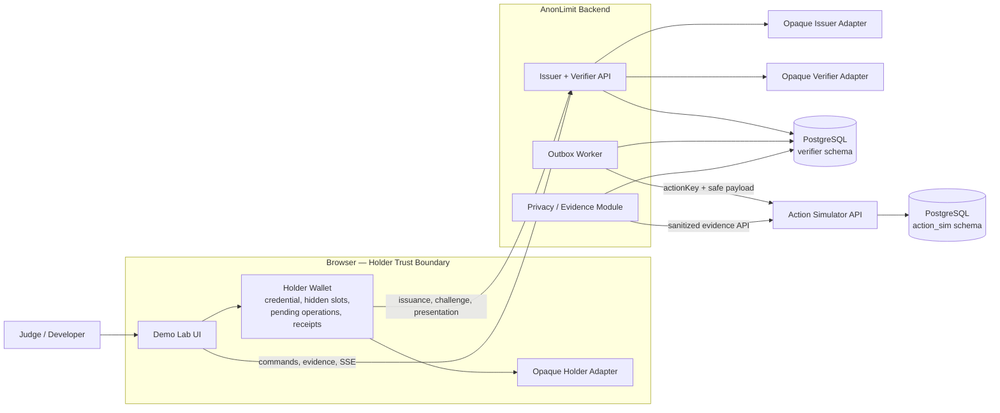
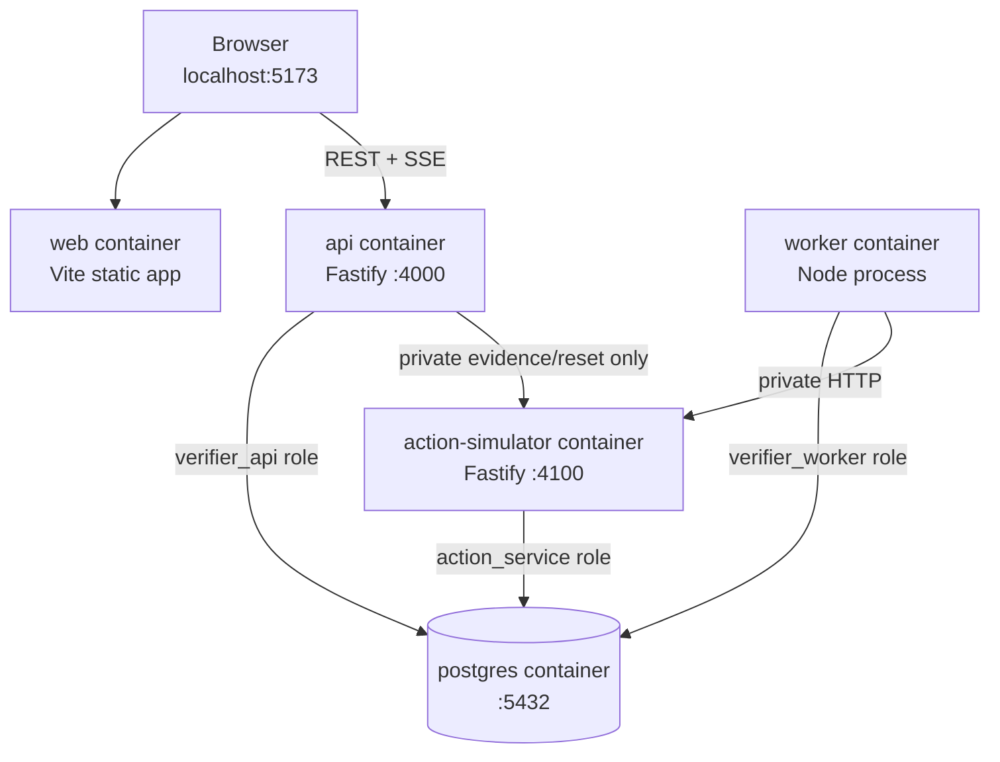
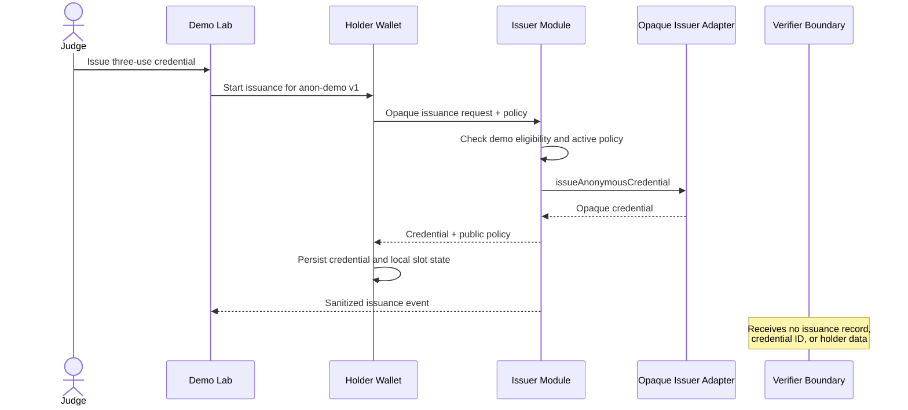
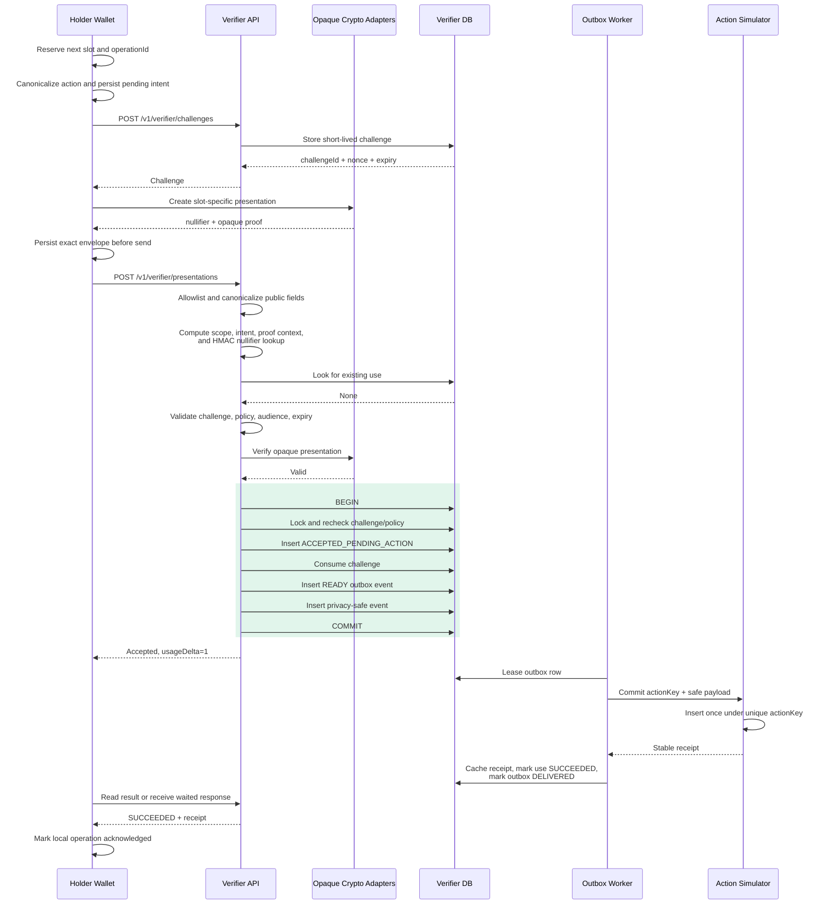
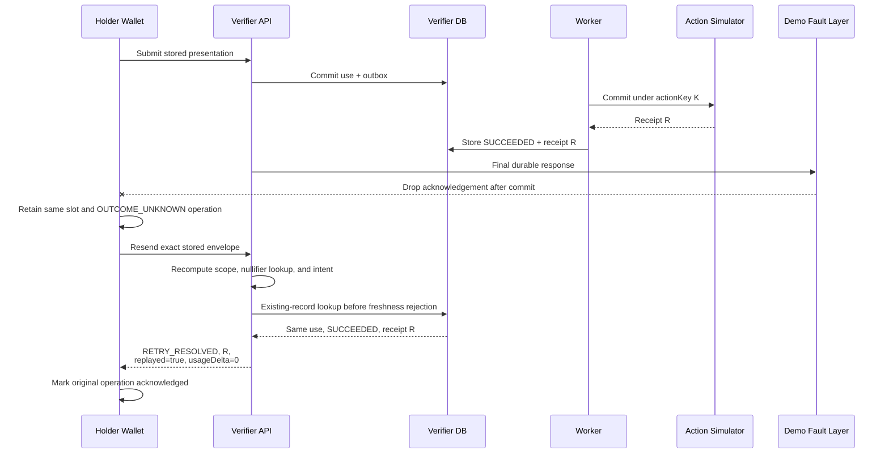
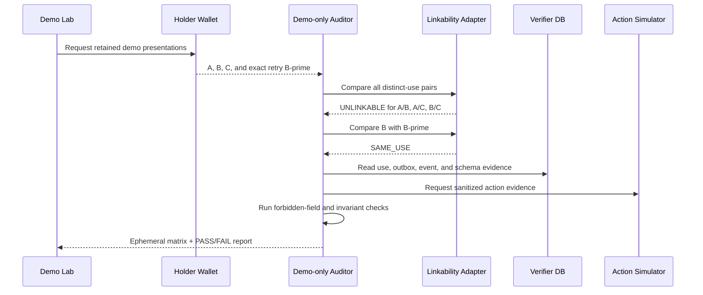

# AnonLimit Architecture

## Application Flow, System Design, Technical Stack, and Repository Structure

| Field | Decision |
|---|---|
| Status | Ready for implementation |
| Version | 1.0 |
| Related requirements | prd.md |
| Runtime style | TypeScript monorepo with four application processes |
| Database | PostgreSQL 17 |
| Default environment | Docker Compose |
| Primary optimization | Correct, polished 24–48-hour hackathon build |

---

## 1. Architecture summary

AnonLimit will be built as a TypeScript monorepo containing four independently runnable applications:

1. **Web:** React Demo Lab and browser-local Holder Wallet.
2. **API:** Issuer, Verifier, demo controls, privacy audit, and evidence endpoints.
3. **Worker:** Durable PostgreSQL outbox consumer.
4. **Action Simulator:** Separate HTTP service that proves repeated delivery cannot duplicate an external effect.

PostgreSQL is the durable coordination layer. It stores verifier state and action-simulator state in separate schemas with separate database roles. No Redis, Kafka, or cloud queue is required.

The issuer and verifier share one API deployment for hackathon speed, but remain separate modules with explicit dependency restrictions. The action simulator stays in a separate process because destination-side idempotency is central to the winning claim.

### Core correctness model

- The opaque proof layer restricts one credential to L hidden use slots.
- Each slot creates one deterministic, scope-specific nullifier.
- PostgreSQL admits each protected nullifier only once.
- A use record and its outbox event commit in one transaction.
- The worker may deliver an event more than once.
- The action simulator commits only once for a stable action key.
- An exact retry returns the existing state or receipt.

### Core privacy model

- The opaque credential and hidden slots stay in the browser wallet.
- The verifier receives raw proof material only in request memory.
- The verifier persists a keyed per-use lookup value, never the raw nullifier.
- No holder ID, credential ID, hidden slot, or cross-use counter exists in verifier storage.
- Linkability-test presentations remain in the wallet/test harness and are sent only transiently to a demo-only auditor.

---

## 2. Architectural goals

- Make all required problem-statement flows runnable from one browser page.
- Preserve the holder, issuer, verifier, and action-service trust boundaries.
- Make exact retry and duplicate-action protection correct under concurrency.
- Recover accepted work after API or worker failure.
- Keep credential operations replaceable through opaque interfaces.
- Prevent sensitive protocol material from entering storage or logs.
- Compute every displayed invariant from authoritative backend evidence.
- Start the complete system with one command.
- Keep component count low enough for a hackathon team to finish and polish.

## 3. Explicit non-goals

- Production anonymous-credential cryptography.
- Microservices for every logical module.
- Kubernetes, service mesh, event broker, GraphQL, or distributed consensus.
- User authentication, user accounts, KYC, or identity recovery.
- Multiple issuer organizations or globally distributed verifier replicas.
- Exactly-once network delivery.
- Scaling beyond the bounded demo and automated concurrency tests.

---

## 4. Technical stack

### 4.1 Chosen stack

| Layer | Technology | Reason |
|---|---|---|
| Runtime | Node.js 24 LTS | Current LTS runtime, shared across every server process |
| Language | TypeScript in strict mode | One type system across browser, API, worker, contracts, and tests |
| Package management | pnpm workspaces | Lightweight monorepo management without extra orchestration |
| Web UI | React with Vite | Fast SPA development; SSR and SEO are unnecessary for the Demo Lab |
| Styling | Tailwind CSS and local shadcn-style primitives | Rapid, consistent, polished interface without a large component framework |
| Server-state UI | TanStack Query | Commands, status refresh, evidence queries, and cache invalidation |
| Wallet persistence | IndexedDB through the idb package | Durable browser-local credential and pending-operation storage |
| API framework | Fastify | Small, fast, schema-driven TypeScript service |
| Validation | Zod | Shared runtime validation and strict public-field allowlists |
| Database | PostgreSQL 17 | Transactions, unique constraints, row locks, and SKIP LOCKED |
| Database access | Drizzle ORM plus node-postgres | Type-safe schema access with explicit SQL for critical concurrency paths |
| Background processing | Custom Node.js PostgreSQL outbox worker | No Redis or broker; correctness remains visible and testable |
| Live trace | Server-Sent Events backed by persisted safe events | One-way live updates with reconnect support and no WebSocket complexity |
| Hashing and lookup protection | Node Crypto and Web Crypto | Protocol digests and verifier-keyed HMAC without another dependency |
| Logging | Pino with custom allowlisted serializers | Structured logs with explicit privacy controls |
| Unit and contract tests | Vitest | Fast TypeScript-native test loop |
| Database integration tests | Testcontainers with PostgreSQL | Tests real constraints, locks, and transaction behavior |
| Browser tests | Playwright | Reproducible guided demo and fault-flow validation |
| Local deployment | Docker Compose | Starts all apps and PostgreSQL consistently |
| Scripts | tsx | Cross-platform TypeScript migration, seed, audit, and demo scripts |

### 4.2 Version policy

- Pin Node to major version 24 in the repository and container images.
- Pin PostgreSQL to major version 17.
- Commit pnpm-lock.yaml.
- Use compatible current stable releases of all JavaScript packages.
- Do not use floating latest tags in Docker Compose or CI.
- Perform dependency upgrades only after the golden scenario passes.

### 4.3 Deliberately excluded dependencies

- No Redis or BullMQ; PostgreSQL already owns the durable outbox.
- No Kafka or RabbitMQ; the demo does not need another failure domain.
- No Redux; TanStack Query plus feature-local React state is sufficient.
- No Next.js; the product is a single authenticated-free control panel with a separate API.
- No blockchain; bounded use does not require a public ledger.
- No home-grown real cryptography; credential operations remain opaque adapters.
- No Turborepo for the MVP; pnpm recursive scripts are sufficient for this repository size.

---

## 5. System context



### Authority by component

| Concern | Authoritative owner |
|---|---|
| Credential material and local slot selection | Holder Wallet |
| Policy and proof validity | Issuer/Verifier adapter contract |
| Whether a use was accepted | PostgreSQL verifier use record |
| Whether accepted work is recoverable | PostgreSQL outbox |
| Whether an external effect exists | Action Simulator |
| Final receipt for one accepted use | Action Simulator, cached by Verifier |
| Displayed counts and PASS/FAIL status | Evidence module reading authoritative state |
| Grouping controlled presentations for the linkability demo | Browser wallet/test harness only |

The frontend is never an authority for counts, acceptance, or action completion.

---

## 6. Runtime topology



### Runtime processes

| Process | Scales independently? | Durable state? | Notes |
|---|---:|---:|---|
| web | Yes | Browser IndexedDB only | Static SPA |
| api | Yes, after MVP | PostgreSQL | Issuer and verifier are separate modules |
| worker | Yes | PostgreSQL | Competes safely through row leases |
| action-simulator | Yes | PostgreSQL action schema | External idempotency boundary |
| postgres | Managed separately | Yes | One instance, separate schemas and roles |

For the hackathon, run one instance of each application. Concurrency tests still use parallel requests and worker claims against real PostgreSQL constraints.

---

## 7. Trust boundaries

### 7.1 Browser Holder Wallet

May hold:

- Opaque credential.
- Hidden local slots.
- Reserved operation ID.
- Intent and serialized pending presentation.
- Acknowledgement state.
- Receipts.
- Presentations retained only for the controlled linkability demonstration.

Storage: browser IndexedDB.

The wallet persists the pending operation before its first send. A timeout must never cause automatic allocation of a new hidden slot.

### 7.2 Issuer module

May receive:

- Simulated eligibility input.
- Blinded or opaque issuance request.
- Public policy reference.

It returns the credential only to the wallet. It does not send a holder record, issuance identifier, or credential serial to the verifier module.

### 7.3 Verifier module

May receive transiently:

- Public policy fields.
- Random operation ID.
- Identity-free action.
- Challenge.
- Per-use nullifier.
- Opaque proof.

May persist:

- Scope hash.
- HMAC-protected nullifier lookup.
- Operation ID and intent digest.
- Use state, action key, and cached receipt.
- Privacy-safe protocol events.

It must not persist or log the raw credential, proof, nullifier, hidden slot, holder identity, credential identifier, IP address, user agent, or unbounded request body.

### 7.4 Worker

Reads accepted use and outbox rows. It receives no credential, proof, hidden slot, raw nullifier, or holder identifier.

### 7.5 Action Simulator

Receives only:

- Stable action key.
- Canonical payload digest.
- Strictly allowlisted identity-free payload.

It owns external-effect uniqueness and cannot read verifier tables.

### 7.6 Privacy Auditor

Reads sanitized verifier and action evidence. Linkability inputs are supplied transiently from the wallet/test harness. Raw presentations and their controlled grouping are not written to verifier storage or logs.

---

## 8. Application flow overview

The default judge journey is:

1. Reset the bounded demo run.
2. Issue a three-use credential to the browser wallet.
3. Complete the first use.
4. Complete the second use while dropping its final acknowledgement.
5. Retry that exact operation and recover the original receipt.
6. Submit use three, optionally as a 20-request concurrent race.
7. Attempt a fourth use and reject it without state change.
8. Run the linkability and storage audit.
9. Display the backend-derived invariant report.

### Scenario delta matrix

| Scenario | New use records | New outbox events | New external effects | Result |
|---|---:|---:|---:|---|
| Credential issuance | 0 | 0 | 0 | Credential exists only in wallet |
| First valid use | 1 | 1 | 1 eventually | Stable receipt |
| Lost-ACK exact retry | 0 | 0 | 0 | Original state or receipt |
| Invalid or over-limit proof | 0 | 0 | 0 | Generic rejection |
| 20-copy fresh race | 1 total | 1 total | 1 total | One use and receipt |
| Conflicting replay | 0 | 0 | 0 | Original state unchanged |
| Worker crash recovery | 0 additional | 0 additional | At most 1 total | Existing work resumes |
| Privacy audit | 0 | 0 | 0 | Evidence-only operation |

---

## 9. Flow 1: Anonymous issuance



Correctness and privacy conditions:

- Credential response is addressed only to the wallet.
- Issuance creates no verifier use record.
- The verifier cannot query which or how many credentials were issued.
- The Demo Lab may show that issuance happened, but the event contains no subject or credential identifier.

---

## 10. Flow 2: First valid use



The presentation endpoint normally returns 202 after acceptance. For the guided demo it may honor a bounded Prefer: wait=3 request, allowing the API to wait briefly for the receipt. It must never perform the external action in the request transaction.

---

## 11. Flow 3: Lost acknowledgement and retry



An accepted retry is resolved before rejecting an expired challenge or changed policy. The committed historical decision remains authoritative.

An exact retry must not:

- Allocate another wallet slot.
- Insert another use record.
- Create another outbox event.
- Invoke a new external action.
- Return a different terminal receipt.

If the use is still pending, return RETRY_IN_PROGRESS for the same use ID. Its existing outbox event remains responsible for completion.

---

## 12. Flow 4: Over-limit rejection

```mermaid
sequenceDiagram
    participant W as Wallet / Demo Harness
    participant V as Verifier API
    participant C as Opaque Verifier Adapter
    participant DB as Verifier DB
    participant AS as Action Simulator

    Note over W: All L valid hidden slots have been exercised
    W->>V: Request challenge for another intent
    V-->>W: Challenge
    W->>W: Test adapter builds out-of-range attempt
    W->>V: Submit presentation
    V->>V: Validate public fields and context
    V->>DB: Check for existing retry
    DB-->>V: No existing use
    V->>C: verifyPresentation
    C-->>V: Invalid; private demo code BOUND_EXCEEDED
    V-->>W: PRESENTATION_REJECTED, usageDelta=0
    Note over DB,AS: No use, outbox, receipt,<br/>or action is created
```

The verifier does not reject the fourth use by looking up a per-credential counter. The bound follows from:

1. Only hidden slots from zero through L minus one can produce a valid proof.
2. Each allowed slot produces one nullifier in the canonical scope.
3. PostgreSQL admits that scoped nullifier only once.

Production-shaped errors remain generic. A demo-only private trace may show BOUND_EXCEEDED without exposing or storing the hidden slot.

---

## 13. Flow 5: Concurrent duplicate race

```mermaid
sequenceDiagram
    participant H as Demo Harness
    participant V1 as Verifier Request 1
    participant V2 as Verifier Requests 2..20
    participant C as Crypto Adapter
    participant DB as PostgreSQL
    participant OW as Worker
    participant AS as Action Simulator

    H->>V1: Fresh presentation P
    H->>V2: 19 identical copies of P
    par Verify independently
        V1->>C: Verify P
        C-->>V1: Valid
    and
        V2->>C: Verify P copies
        C-->>V2: Valid
    end

    V1->>DB: Acceptance transaction
    V2->>DB: Concurrent acceptance transactions
    DB-->>V1: One insert wins
    DB-->>V2: Unique-constraint conflicts
    V2->>DB: Roll back and load winning use
    DB-->>V2: Same use ID and intent
    V1-->>H: usageDelta=1
    V2-->>H: usageDelta=0; same use
    OW->>AS: Deliver one stable action key
    AS-->>OW: One stable receipt
    Note over H,AS: All successful callers converge<br/>on one use and receipt
```

The database constraint, not an in-memory mutex, is authoritative. Use the fresh third presentation for this demo so the race visibly exercises first acceptance.

---

## 14. Flow 6: Worker crash and redelivery

```mermaid
sequenceDiagram
    participant DB as Verifier DB
    participant W1 as Worker 1
    participant W2 as Worker 2
    participant AS as Action Simulator
    participant V as Verifier API
    participant H as Holder Wallet

    W1->>DB: Lease READY outbox event
    W1->>AS: Commit action key K, digest D
    AS->>AS: Create one effect for K
    AS-->>W1: Receipt R
    W1-xDB: Crash before local completion

    Note over DB: Lease expires; accepted use survives
    DB->>W2: Lease expired event
    W2->>AS: Redeliver K and D
    AS->>AS: Existing K and same D
    AS-->>W2: Return original R; no new effect
    W2->>DB: Mark use SUCCEEDED and outbox DELIVERED

    H->>V: Exact retry or result query
    V->>DB: Load terminal use
    DB-->>V: Original receipt R
    V-->>H: Original receipt R
```

This is at-least-once delivery with one committed effect at an idempotent destination. It is not exactly-once networking.

---

## 15. Flow 7: Privacy and linkability audit



Request-body logging is disabled on the audit route. Raw presentations and their test grouping are not persisted. SAME_USE for the retry is intentional and does not link different legitimate allowances.

---

## 16. Protocol computations

### 16.1 Canonical quota scope

```text
scope =
  issuerKeyId
  || policyId
  || policyVersion
  || verifierAudience
  || quotaWindowId
```

The issuer authorizes these values and the verifier reconstructs them. The client cannot supply a different effective scope.

### 16.2 Nullifier contract

```text
NF_i = PRF_x("AnonLimit/v1" || scope || hiddenSlot_i)
where 0 <= hiddenSlot_i < maxUses
```

The operation ID, request payload, and challenge are deliberately excluded from nullifier derivation. Changing request-controlled data must not create a new nullifier for the same slot.

### 16.3 Intent and proof context

```text
intentDigest = H(
  protocolVersion
  || operationId
  || method
  || resource
  || canonicalActionPayload
)

proofContext = H(
  protocolVersion
  || scope
  || intentDigest
  || verifierChallenge
)

nullifierKey = HMAC-SHA-256(
  verifierLedgerKey,
  H(scope) || rawNullifier
)

actionKey = HMAC-SHA-256(
  verifierActionKey,
  useId || intentDigest
)
```

Raw nullifier and proof values are discarded after request processing. Only nullifierKey is persisted.

### 16.4 Opaque crypto package entrypoints

The crypto package exposes explicit subpaths:

- @anonlimit/crypto/holder — browser-safe presentation generation.
- @anonlimit/crypto/issuer — server-only issuance.
- @anonlimit/crypto/verifier — server-only proof verification and lookup protection.
- @anonlimit/crypto/audit — linkability test adapter.

The web build must be unable to import issuer or verifier entrypoints. Private key material comes only from server environment variables or mounted secrets and never from source files.

---

## 17. Presentation acceptance algorithm

POST /v1/verifier/presentations is processed in this exact order:

1. Validate content type and size.
2. Reject unknown public fields using the shared Zod contract.
3. Canonicalize the allowlisted action.
4. Recompute scope, intent digest, and proof context.
5. Calculate nullifierKey in memory.
6. Query for an accepted row with the same scoped nullifier or operation ID.
7. If an exact match exists, return its pending state or cached terminal result.
8. If immutable intent differs, return NULLIFIER_REUSE_CONFLICT or IDEMPOTENCY_CONFLICT.
9. Validate challenge, audience, policy version, window, and expiry.
10. Call the opaque verifier. This step performs no database writes.
11. Begin one PostgreSQL transaction.
12. Lock, re-read, and recheck authoritative policy and challenge state inside that transaction.
13. Insert one ACCEPTED_PENDING_ACTION use record.
14. Change the challenge from ISSUED to CONSUMED.
15. Insert one READY outbox event.
16. Insert one privacy-safe USE_ACCEPTED event.
17. Commit.
18. If a uniqueness conflict occurs, roll back, load the winning row, and classify it as an exact retry or conflict.
19. Return 202, or briefly wait for the result when the demo wait preference is enabled.

### Required unique constraints

```sql
UNIQUE (demo_run_id, scope_hash, nullifier_key)
UNIQUE (demo_run_id, scope_hash, operation_id)
UNIQUE (action_key)
UNIQUE (use_id, event_type)
```

demo_run_id isolates resettable hackathon scenarios. It is an operational scenario identifier, not a credential or holder identity or an extra allowance domain. The server owns the active run; clients cannot select another run to multiply a credential's allowance. Reset invalidates prior-run demo credentials, challenges, and wallet pending operations. Issuance and verification enforce prior-run credential rejection even when an old credential is submitted with the new run ID; clearing browser state alone is insufficient. This boundary must not introduce a credential-wide identifier into verifier storage.

### Retry classification

| Existing row | Incoming request | Result |
|---|---|---|
| None | Valid new use | Accept once |
| Pending | Same nullifier, operation, and intent | RETRY_IN_PROGRESS; delta 0 |
| Succeeded | Same nullifier, operation, and intent | RETRY_RESOLVED with cached receipt; delta 0 |
| Failed final | Same nullifier, operation, and intent | Return cached terminal failure; delta 0 |
| Any | Same nullifier, different intent | NULLIFIER_REUSE_CONFLICT |
| Any | Same operation ID, different content | IDEMPOTENCY_CONFLICT |

---

## 18. Outbox worker architecture

### Lease query

The worker claims a small batch in a transaction using row locks:

```sql
SELECT event_id
FROM verifier.outbox_events
WHERE state IN ('READY', 'LEASED')
  AND next_attempt_at <= now()
  AND (lease_until IS NULL OR lease_until < now())
ORDER BY created_at
FOR UPDATE SKIP LOCKED
LIMIT 10;
```

It then marks those rows LEASED, assigns lease_until, increments attempt_count, and commits before making HTTP calls.

### Delivery

The worker sends:

```http
POST /internal/v1/actions
Idempotency-Key: <actionKey>
Authorization: Bearer <internal service token>
Content-Type: application/json

{
  "demoRunId": "<operational demo run>",
  "actionKey": "<stable key>",
  "payloadDigest": "<canonical digest>",
  "action": {
    "type": "REDEEM_DEMO_BENEFIT",
    "payload": {
      "benefitCode": "HACKATHON"
    }
  }
}
```

### Result handling

- New action key: Action Simulator commits one effect and creates a receipt.
- Existing key with same digest: it returns the existing receipt.
- Existing key with different digest: it returns an integrity conflict.
- Retryable failure: worker applies bounded exponential backoff.
- Worker crash: lease expires and another worker resumes.
- Exhausted attempts: event becomes DEAD_LETTER and remains visible as recoverable operator work.
- Successful response: one transaction caches the receipt, marks the use SUCCEEDED, marks the outbox DELIVERED, and writes a safe event.

The verifier and action schemas never participate in one cross-service database transaction.

---

## 19. Data architecture

### 19.1 PostgreSQL schemas

Use one PostgreSQL instance for the hackathon with two ownership boundaries:

```text
verifier
  demo_runs
  quota_policies
  verification_challenges
  use_records
  outbox_events
  protocol_events
  demo_faults

action_sim
  action_results
  action_faults
```

### 19.2 Database roles

| Role | Permissions |
|---|---|
| migration_owner | Creates schemas, roles, tables, constraints, and views |
| verifier_api | Read/write verifier policies, challenges, uses, events, and demo controls |
| verifier_worker | Lease/update outbox, update use results, append safe events |
| action_service | Read/write action_sim tables only |
| evidence_reader | Read sanitized views only |

The API cannot directly write action results. The Action Simulator cannot read verifier records. The worker interacts with the action boundary over HTTP.

### 19.3 Core table ownership

| Table | Writer | Purpose |
|---|---|---|
| demo_runs | API demo module | Isolates deterministic scenarios |
| quota_policies | API policy module | Immutable policy versions |
| verification_challenges | API verifier module | Short-lived request binding |
| use_records | API acceptance transaction; worker completion | Accepted per-use state |
| outbox_events | API acceptance transaction; worker | Durable external work |
| protocol_events | API and worker | Allowlisted trace events |
| demo_faults | API demo module | Demo-only fault controls |
| action_results | Action Simulator only | External-effect uniqueness and receipt |

### 19.4 Critical fields

use_records:

```text
use_id
demo_run_id
scope_hash
nullifier_key
operation_id
intent_digest
status
action_key
cached_result
created_at
completed_at
```

outbox_events:

```text
event_id
use_id
event_type
action_key
safe_payload
state
attempt_count
next_attempt_at
lease_until
last_error_code
created_at
delivered_at
```

No verifier table has a credential ID, holder ID, hidden slot, raw credential, raw proof, or raw nullifier column.

action_sim.action_results:

```text
action_key
demo_run_id
payload_digest
receipt
committed_at
```

demo_run_id exists only to reset and report on an isolated hackathon scenario. It is not a holder or credential identifier.

---

## 20. API surface

### Public demo and product endpoints

| Method | Path | Owner | Purpose |
|---|---|---|---|
| GET | /v1/policies/{id}/versions/{version} | Policy | Fetch canonical public policy |
| POST | /v1/issuer/credentials | Issuer | Issue opaque credential to wallet |
| POST | /v1/verifier/challenges | Verifier | Bind challenge to intended operation |
| POST | /v1/verifier/presentations | Verifier | Accept, retry, or reject a presentation |
| GET | /v1/verifier/uses/{useId} | Verifier | Read pending or terminal state |
| GET | /v1/demo/events/stream | Events | Privacy-safe SSE trace |
| GET | /v1/demo/evidence | Evidence | Backend-derived invariant report |
| POST | /v1/demo/linkability-test | Auditor | Run transient pairwise test |
| POST | /v1/demo/faults/drop-next-ack | Demo | Arm lost-ack fault |
| POST | /v1/demo/races/presentation | Demo | Submit controlled concurrent copies |
| POST | /v1/demo/reset | Demo | Reset bounded demo state |

### Internal Action Simulator endpoints

| Method | Path | Purpose |
|---|---|---|
| POST | /internal/v1/actions | Commit or recover one idempotent action |
| GET | /internal/v1/evidence | Return sanitized action counts and receipts |
| POST | /internal/v1/demo/reset | Reset action-simulator demo state |
| POST | /internal/v1/demo/faults | Arm worker/action recovery faults |

Internal endpoints require a service token and are not exposed by the public reverse proxy.

### API rules

- Every mutating public request has a strict size limit and Zod schema.
- Unknown fields are rejected rather than stripped.
- The presentation and audit routes disable body logging.
- Error responses contain stable machine codes and safe messages.
- Demo-only diagnostics and reset/fault endpoints require DEMO_MODE=true.
- CORS permits only the configured web origin.
- Rate limiting is optional for the local demo and must not introduce identity tracking.

---

## 21. Web application architecture

The web application is a single-page Demo Lab. It has no server-side rendering requirement.

### Screen layout

1. **Header:** pitch, policy limit, run ID, reset.
2. **Scenario controls:** issue, present, drop acknowledgement, retry, race, over-limit, audit.
3. **Holder Wallet:** local credential state, available/reserved/acknowledged slots.
4. **Protocol Trace:** four swimlanes for Issuer, Wallet, Verifier, and Action Service.
5. **Verifier Evidence:** sanitized use/action references and receipts.
6. **Invariant Summary:** machine-derived PASS/FAIL cards.
7. **Linkability Evidence:** required pairwise checks report distinct uses as UNLINKABLE and exact retry as SAME_USE. The matrix visualization is optional when time is short; aggregate evidence remains required.
8. **Assumptions Drawer:** opaque-crypto guarantees and explicit non-goals.

### Client state

| State | Storage | Authority |
|---|---|---|
| Credential and hidden slots | IndexedDB | Wallet |
| Pending operation and serialized envelope | IndexedDB before send | Wallet retry behavior |
| Selected UI panel and animation state | React local state | Presentation only |
| Policies, use status, evidence | TanStack Query cache | Backend remains authoritative |
| Timeline events | In-memory view from SSE cursor | Persisted event table remains authoritative |
| Invariant totals | Never independently counted | Evidence API |

### Live-event delivery

All API and worker events first enter verifier.protocol_events with a monotonic sequence. The SSE route streams rows after the client's last sequence. It may poll PostgreSQL at a short interval; no broker is needed.

On reconnect, the browser sends Last-Event-ID and receives missed safe events. Event payloads use a shared allowlisted contract.

---

## 22. Privacy-safe observability

### Allowed event fields

- Random trace ID.
- Demo run ID.
- Policy ID and version.
- State transition.
- Decision code.
- Latency.
- Usage delta.
- External-action delta.
- Masked per-use reference.

### Forbidden event and log fields

- Credential or proof blob.
- Raw nullifier or hidden slot.
- Name, email, account, patient, or subject identifier.
- Credential serial or holder public key.
- Request body, headers, cookies, IP address, or user agent.
- Test-harness grouping of presentations.
- Secrets or key material.

Fastify/Pino serializers must log only method, route template, safe trace ID, status code, duration, and safe error code. Do not serialize the default request object or arbitrary errors containing request data.

The privacy audit scans:

- Verifier information_schema columns.
- Persisted row values against known test secrets.
- Captured structured logs.
- Outbox payloads.
- Evidence exports.

---

## 23. Repository structure

```text
anonlimit/
├─ apps/
│  ├─ web/                                  # React Demo Lab + Holder Wallet
│  │  ├─ public/
│  │  │  └─ favicon.svg
│  │  ├─ src/
│  │  │  ├─ app/
│  │  │  │  ├─ App.tsx
│  │  │  │  ├─ providers.tsx              # Query client and error boundary
│  │  │  │  └─ routes.tsx
│  │  │  ├─ features/
│  │  │  │  ├─ demo-lab/
│  │  │  │  │  ├─ DemoLabPage.tsx
│  │  │  │  │  ├─ DemoControls.tsx
│  │  │  │  │  └─ useDemoController.ts
│  │  │  │  ├─ wallet/
│  │  │  │  │  ├─ WalletPanel.tsx
│  │  │  │  │  ├─ wallet-db.ts            # IndexedDB schema
│  │  │  │  │  ├─ wallet-service.ts       # Slot and retry rules
│  │  │  │  │  └─ wallet.types.ts
│  │  │  │  ├─ protocol-trace/
│  │  │  │  │  ├─ ProtocolTrace.tsx
│  │  │  │  │  ├─ Swimlane.tsx
│  │  │  │  │  └─ useEventStream.ts
│  │  │  │  ├─ evidence/
│  │  │  │  │  ├─ EvidencePanel.tsx
│  │  │  │  │  └─ EvidenceTable.tsx
│  │  │  │  ├─ invariants/
│  │  │  │  │  └─ InvariantSummary.tsx
│  │  │  │  ├─ linkability/
│  │  │  │  │  └─ LinkabilityMatrix.tsx
│  │  │  │  └─ assumptions/
│  │  │  │     └─ CryptoBoundaryCard.tsx
│  │  │  ├─ components/ui/                # Local UI primitives
│  │  │  ├─ lib/
│  │  │  │  ├─ api-client.ts
│  │  │  │  ├─ query-keys.ts
│  │  │  │  └─ formatters.ts
│  │  │  ├─ styles/globals.css
│  │  │  └─ main.tsx
│  │  ├─ index.html
│  │  ├─ vite.config.ts
│  │  └─ package.json
│  │
│  ├─ api/                                  # Issuer, Verifier, Evidence, Demo
│  │  ├─ src/
│  │  │  ├─ app.ts                         # Build app without listening
│  │  │  ├─ server.ts                      # Runtime entrypoint
│  │  │  ├─ plugins/
│  │  │  │  ├─ database.ts
│  │  │  │  ├─ error-handler.ts
│  │  │  │  ├─ privacy-logger.ts
│  │  │  │  └─ request-context.ts
│  │  │  ├─ modules/
│  │  │  │  ├─ policies/
│  │  │  │  │  ├─ policy.routes.ts
│  │  │  │  │  └─ policy.service.ts
│  │  │  │  ├─ issuer/
│  │  │  │  │  ├─ issuer.routes.ts
│  │  │  │  │  └─ issue-credential.ts
│  │  │  │  ├─ challenges/
│  │  │  │  │  ├─ challenge.routes.ts
│  │  │  │  │  └─ challenge.service.ts
│  │  │  │  ├─ presentations/
│  │  │  │  │  ├─ presentation.routes.ts
│  │  │  │  │  ├─ submit-presentation.ts
│  │  │  │  │  ├─ resolve-existing-use.ts
│  │  │  │  │  └─ wait-for-outcome.ts
│  │  │  │  ├─ events/
│  │  │  │  │  ├─ events.routes.ts
│  │  │  │  │  └─ event.service.ts
│  │  │  │  ├─ evidence/
│  │  │  │  │  ├─ evidence.routes.ts
│  │  │  │  │  ├─ build-invariant-report.ts
│  │  │  │  │  └─ run-privacy-audit.ts
│  │  │  │  └─ demo/
│  │  │  │     ├─ demo.routes.ts
│  │  │  │     ├─ reset-demo.ts
│  │  │  │     └─ fault-controller.ts
│  │  │  └─ internal/
│  │  │     └─ action-simulator-client.ts
│  │  └─ package.json
│  │
│  ├─ worker/                               # Durable outbox processor
│  │  ├─ src/
│  │  │  ├─ main.ts
│  │  │  ├─ worker-loop.ts
│  │  │  ├─ lease-outbox-batch.ts
│  │  │  ├─ process-action.ts
│  │  │  ├─ complete-use.ts
│  │  │  ├─ retry-policy.ts
│  │  │  └─ shutdown.ts
│  │  └─ package.json
│  │
│  └─ action-simulator/                     # External idempotency boundary
│     ├─ src/
│     │  ├─ app.ts
│     │  ├─ server.ts
│     │  ├─ routes/
│     │  │  ├─ actions.routes.ts
│     │  │  ├─ evidence.routes.ts
│     │  │  └─ demo.routes.ts
│     │  ├─ commit-action.ts
│     │  └─ fault-controller.ts
│     └─ package.json
│
├─ packages/
│  ├─ domain/                               # Pure rules; no framework imports
│  │  ├─ src/
│  │  │  ├─ policy.ts
│  │  │  ├─ quota-scope.ts
│  │  │  ├─ intent.ts
│  │  │  ├─ use-state.ts
│  │  │  ├─ retry-classifier.ts
│  │  │  ├─ invariants.ts
│  │  │  ├─ events.ts
│  │  │  ├─ errors.ts
│  │  │  └─ ports.ts
│  │  └─ package.json
│  │
│  ├─ contracts/                            # Runtime-validated wire contracts
│  │  ├─ src/
│  │  │  ├─ policy.contract.ts
│  │  │  ├─ issuance.contract.ts
│  │  │  ├─ challenge.contract.ts
│  │  │  ├─ presentation.contract.ts
│  │  │  ├─ operation.contract.ts
│  │  │  ├─ evidence.contract.ts
│  │  │  ├─ event.contract.ts
│  │  │  ├─ demo.contract.ts
│  │  │  ├─ public-field-allowlist.ts
│  │  │  └─ index.ts
│  │  └─ package.json
│  │
│  ├─ crypto/                               # Opaque ports and simulator
│  │  ├─ src/
│  │  │  ├─ types.ts
│  │  │  ├─ holder/index.ts
│  │  │  ├─ issuer/index.ts
│  │  │  ├─ verifier/index.ts
│  │  │  ├─ verifier/nullifier-lookup.ts
│  │  │  ├─ audit/linkability.ts
│  │  │  └─ simulated-provider/
│  │  │     ├─ issue.ts
│  │  │     ├─ present.ts
│  │  │     ├─ verify.ts
│  │  │     └─ linkability.ts
│  │  ├─ package.json                      # Explicit subpath exports
│  │  └─ README.md                         # Guarantees vs assumptions
│  │
│  ├─ db/                                   # Server-only Drizzle/repositories
│  │  ├─ src/
│  │  │  ├─ client.ts
│  │  │  ├─ verifier/
│  │  │  │  ├─ schema.ts
│  │  │  │  ├─ policy.repository.ts
│  │  │  │  ├─ challenge.repository.ts
│  │  │  │  ├─ use.repository.ts
│  │  │  │  ├─ outbox.repository.ts
│  │  │  │  ├─ event.repository.ts
│  │  │  │  └─ evidence.queries.ts
│  │  │  ├─ action/
│  │  │  │  ├─ schema.ts
│  │  │  │  └─ action.repository.ts
│  │  │  └─ transaction.ts
│  │  ├─ migrations/
│  │  │  ├─ verifier/
│  │  │  │  ├─ 0001_core.sql
│  │  │  │  ├─ 0002_outbox.sql
│  │  │  │  └─ 0003_evidence_views.sql
│  │  │  └─ action/
│  │  │     └─ 0001_external_actions.sql
│  │  ├─ drizzle.config.ts
│  │  └─ package.json
│  │
│  ├─ observability/
│  │  ├─ src/
│  │  │  ├─ logger.ts
│  │  │  ├─ safe-event.ts
│  │  │  ├─ redaction.ts
│  │  │  └─ forbidden-fields.ts
│  │  └─ package.json
│  │
│  ├─ config/
│  │  ├─ src/
│  │  │  ├─ server-env.ts
│  │  │  └─ client-env.ts
│  │  └─ package.json
│  │
│  └─ testing/                              # Never imported by production
│     ├─ src/
│     │  ├─ fixtures/
│     │  ├─ harness/create-test-system.ts
│     │  ├─ scenarios/golden-scenario.ts
│     │  ├─ assertions/
│     │  │  ├─ invariants.ts
│     │  │  └─ privacy.ts
│     │  ├─ faults/deterministic-faults.ts
│     │  └─ scanners/
│     │     ├─ database-scanner.ts
│     │     └─ log-scanner.ts
│     └─ package.json
│
├─ tests/                                    # Cross-process tests
│  ├─ contract/opaque-crypto-provider.test.ts
│  ├─ integration/
│  │  ├─ presentation-flow.test.ts
│  │  ├─ concurrent-duplicate.test.ts
│  │  ├─ outbox-recovery.test.ts
│  │  └─ action-idempotency.test.ts
│  ├─ privacy/
│  │  ├─ schema-audit.test.ts
│  │  └─ forbidden-data.test.ts
│  └─ e2e/golden-demo.spec.ts
│
├─ scripts/
│  ├─ migrate.ts
│  ├─ seed-default-policy.ts
│  ├─ reset-demo.ts
│  ├─ run-golden.ts
│  ├─ run-concurrency-race.ts
│  ├─ scan-forbidden-data.ts
│  └─ wait-for-services.ts
│
├─ infra/
│  ├─ docker/
│  │  ├─ web.Dockerfile
│  │  ├─ api.Dockerfile
│  │  ├─ worker.Dockerfile
│  │  └─ action-simulator.Dockerfile
│  └─ postgres/
│     └─ 00-create-schemas-and-roles.sql
│
├─ docs/
│  ├─ demo-script.md
│  └─ threat-model.md
├─ .github/workflows/ci.yml
├─ .env.example
├─ .gitignore
├─ compose.yaml
├─ package.json
├─ pnpm-lock.yaml
├─ pnpm-workspace.yaml
├─ tsconfig.base.json
├─ eslint.config.mjs
├─ prettier.config.mjs
├─ vitest.workspace.ts
├─ playwright.config.ts
├─ prd.md
├─ architecture.md
└─ README.md
```

---

## 24. Dependency rules

```text
web
  -> contracts
  -> domain
  -> crypto/holder

api
  -> contracts
  -> domain
  -> crypto/issuer
  -> crypto/verifier
  -> crypto/audit
  -> db/verifier
  -> observability

worker
  -> domain
  -> db/verifier
  -> observability

action-simulator
  -> contracts/internal-action
  -> db/action
  -> observability

testing
  -> all packages
  production -> never imports testing
```

Enforce these rules with package export maps and ESLint no-restricted-imports:

- domain imports no app, HTTP, database, React, or Fastify code.
- web cannot import db, crypto/issuer, or crypto/verifier.
- API cannot import db/action; it reaches the Action Simulator over HTTP.
- Worker cannot import holder or issuer crypto.
- Action Simulator cannot import verifier repositories.
- Test fixtures and credential group labels cannot be imported into production builds.
- Avoid a single crypto barrel export that could bundle server-only code into the browser.

---

## 25. Configuration

### Required server environment variables

```text
NODE_ENV
DEMO_MODE
API_PORT
WEB_ORIGIN

DATABASE_URL_API
DATABASE_URL_WORKER
DATABASE_URL_ACTION

VERIFIER_LEDGER_HMAC_KEY
VERIFIER_ACTION_HMAC_KEY
ACTION_SERVICE_URL
ACTION_SERVICE_TOKEN

OPAQUE_CRYPTO_PROVIDER
ISSUER_KEY_ID
ISSUER_PRIVATE_KEY_PATH
ISSUER_PUBLIC_PARAMETERS_PATH

OUTBOX_BATCH_SIZE
OUTBOX_POLL_MS
OUTBOX_LEASE_MS
OUTBOX_MAX_ATTEMPTS
DEMO_WAIT_FOR_RESULT_MS

LOG_LEVEL
```

### Browser environment variables

```text
VITE_API_BASE_URL
VITE_DEMO_MODE
```

Anything prefixed with VITE is public. Never place cryptographic keys, service tokens, or database credentials in browser variables.

Configuration is parsed once at startup through Zod. The process must fail closed if a required secret or URL is missing.

---

## 26. Local deployment

Docker Compose starts:

- web
- api
- worker
- action-simulator
- postgres
- one short-lived migration and seed job

### Startup order

1. PostgreSQL health check succeeds.
2. Migration job creates roles, schemas, constraints, and views.
3. Seed job creates the default anon-demo policy.
4. API and Action Simulator start and pass health checks.
5. Worker begins polling.
6. Web becomes available.

### Health endpoints

| Service | Endpoint | Checks |
|---|---|---|
| API | /health/live | Process is running |
| API | /health/ready | Verifier DB reachable; policy loaded |
| Worker | internal heartbeat row | Poll loop and DB reachable |
| Action Simulator | /health/ready | Action DB reachable |
| Web | / | Static app served |

### Network exposure

- Public: web and API.
- Private Docker network only: Action Simulator and PostgreSQL.
- The worker exposes no public port.

For hosted judging, deploy the same four application containers with managed PostgreSQL. No architectural rewrite should be required.

---

## 27. Test architecture

### Unit tests

- Pure domain functions.
- Canonical action and intent digest.
- Scope construction.
- Retry classifier.
- State transition guards.
- Event allowlists and redaction.
- Environment parsing.

### Opaque-adapter contract tests

- Slots zero through L minus one verify.
- Slot L fails.
- Same credential/scope/slot yields the same nullifier.
- Different allowed slots yield distinct nullifiers.
- Different allowed slots return UNLINKABLE.
- Same use retry returns SAME_USE.
- Wrong audience, policy, challenge, or request digest fails.
- No public output exposes credential ID or hidden slot.

### PostgreSQL integration tests

Use Testcontainers rather than an in-memory substitute:

- Acceptance transaction commits use and outbox together.
- Rollback leaves neither row.
- Unique constraints resolve 20 concurrent submissions.
- SKIP LOCKED allows competing worker loops without duplicate ownership.
- Expired leases are recoverable.
- Same action key commits one action result.

### Cross-process failure tests

- Kill API after acceptance and before response.
- Kill worker before action delivery.
- Kill worker after action commit and before local completion.
- Drop final client acknowledgement after durable completion.
- Expire the original challenge before exact retry.
- Change payload on retry and assert conflict.

### Browser end-to-end test

Playwright runs the core P0 judge flow and, after Phase 9 is implemented, its full race variant:

1. Reset.
2. Issue.
3. Use one.
4. Arm dropped acknowledgement.
5. Use two and observe outcome unknown.
6. Retry and recover.
7. Submit use three normally for P0. In the full variant, race twenty copies of this previously unused third-use presentation and require one use, outbox event, action, and receipt.
8. Attempt fourth use.
9. Run audit.
10. Assert every invariant card displays PASS.

Run the applicable golden variant 100 times through the reusable test harness before submission. Phase 9 starts only after G8. A 24-hour P0 baseline may explicitly omit Phase 9, but cannot claim its race/crash validation or the full-project completion checklist has passed.

---

## 28. Security guardrails

- Treat all public input as untrusted.
- Reject unknown fields rather than silently retaining them.
- Use constant-time comparison for sensitive digests where applicable.
- Derive nullifier lookup values with an environment-held HMAC key.
- Never include request-controlled data in the nullifier domain.
- Validate challenge and policy before the acceptance transaction.
- Recheck them while holding database locks immediately before acceptance.
- Use parameterized queries only.
- Use TLS in hosted environments.
- Restrict internal routes with a service token and private network.
- Disable reset, fault injection, private diagnostics, and schema audit unless DEMO_MODE=true.
- Keep issuer private key material outside source control and browser bundles.
- Set response and request size limits.
- Add a Content Security Policy to reduce wallet-script injection risk.
- Avoid third-party analytics, session replay, or tracking scripts.
- Scan built web assets to ensure server-only crypto and secrets were not bundled.

---

## 29. Failure behavior

| Failure | Required architecture response |
|---|---|
| Opaque proof invalid | Reject before state transaction |
| Challenge expired before first acceptance | Reject without consumption |
| Database fails before commit | Roll back use, challenge change, event, and outbox |
| API dies after commit | Retry finds existing accepted use |
| Response lost after action completion | Exact POST retry returns cached receipt |
| Duplicate requests race | Unique constraint selects one accepted row |
| Same nullifier changes intent | Conflict; original use remains immutable |
| Worker dies before delivery | Lease expires; another worker resumes |
| Worker dies after external commit | Action Simulator returns original receipt on redelivery |
| Action service temporarily fails | Outbox retries with bounded backoff |
| Action service rejects permanently | One stable FAILED_FINAL result |
| SSE connection drops | Reconnect using last event sequence |
| Audit adapter unavailable | Core results remain; privacy audit shows explicit incomplete status |

---

## 30. Implementation order

phases.md is the authoritative dependency schedule and defines the blocking gates:

0. Kickoff and scope lock.
1. Repository and runtime foundation.
2. Protocol kernel and opaque crypto contract.
3. Database foundation and durable acceptance.
4. First complete end-to-end use.
5. Lost acknowledgement and safe retry.
6. Bound enforcement, conflicts, and deterministic reset.
7. Authoritative evidence and privacy scans.
8. Guided judge experience and G8 P0 lock.
9. P1 resilience: concurrent race and crash recovery validation, only after G8.
10. Release and rehearsal, including the applicable 100-run golden soak.

Phase 9 may be explicitly omitted for a 24-hour P0 baseline; Phase 10 is always required. Full-project completion still requires race and crash validation. P2 is excluded from the hackathon. Earlier privacy, idempotency, and durable-recovery requirements remain blocking regardless of whether Phase 9 is included.

---

## 31. Key architecture decisions

| Decision | Choice | Why |
|---|---|---|
| UI delivery | React SPA with Vite | Fast build; no SSR/SEO need |
| Backend shape | Modular API, not many microservices | Keeps issuer/verifier boundaries without deployment overhead |
| External action | Separate service | Makes destination idempotency independently provable |
| Durable queue | PostgreSQL outbox | Removes broker while preserving crash recovery |
| Coordination | Unique constraints and row leases | Works across processes; no fragile local locks |
| Wallet storage | IndexedDB | Pending retry survives refresh or transient failure |
| Live updates | Persisted events plus SSE | Simple one-way stream with replay |
| ORM | Drizzle plus explicit SQL | Types for ordinary access; full control for critical transactions |
| Credential crypto | Opaque adapter ports | Meets scope without inventing unsafe cryptography |
| Test database | Real PostgreSQL in Testcontainers | In-memory DB cannot prove lock/constraint behavior |
| Monorepo build | pnpm workspaces | Sufficiently simple for a hackathon |

---

## 32. Architecture completion checklist

This is the full-project checklist. An explicitly scoped P0 baseline must disclose omitted Phase 9 race/crash validation rather than mark those items complete.

- Four apps start through Docker Compose.
- Browser credential and pending operation remain in IndexedDB.
- Issuer never sends issuance identity data to verifier code.
- Web bundle contains only the holder crypto entrypoint.
- Acceptance ordering matches Section 17.
- All four unique constraints exist in migrations.
- Use and outbox rows commit atomically.
- Worker uses SKIP LOCKED leases.
- Action Simulator is independently idempotent by action key.
- Exact retry is resolved before challenge freshness rejection.
- Raw credential, proof, nullifier, and hidden slot are absent from verifier persistence.
- Logs contain only allowlisted event fields.
- Evidence API derives results from database and Action Simulator state.
- Linkability inputs are transient and not persisted.
- Demo faults are impossible when DEMO_MODE is false.
- 20-copy race creates one use, outbox event, action, and receipt.
- Crash-after-action test returns the same receipt without another effect.
- The Playwright golden flow passes from a clean reset.

---

## 33. Current official references

- Node.js releases: https://nodejs.org/en/about/previous-releases
- Vite guide: https://vite.dev/guide/
- React documentation: https://react.dev/learn
- Fastify TypeScript: https://fastify.dev/docs/latest/Reference/TypeScript/
- Fastify logging and redaction: https://fastify.dev/docs/latest/Reference/Logging/
- PostgreSQL SKIP LOCKED: https://www.postgresql.org/about/featurematrix/detail/skip-locked-clause/
- Drizzle PostgreSQL: https://orm.drizzle.team/docs/get-started-postgresql
- Drizzle transactions: https://orm.drizzle.team/docs/transactions
- TanStack Query: https://tanstack.com/query/latest/docs/framework/react/installation
- Tailwind with React tooling: https://tailwindcss.com/docs/installation
- Testcontainers for Node.js and PostgreSQL: https://testcontainers.com/guides/getting-started-with-testcontainers-for-nodejs/
- Playwright: https://playwright.dev/docs/intro

---

## 34. Final architecture statement

AnonLimit does not track a person to enforce a limit. The opaque proof restricts a credential to a finite set of hidden uses, PostgreSQL admits each use once, the outbox preserves accepted work, and the external action service commits each effect once. The UI then proves those properties from real system state.
