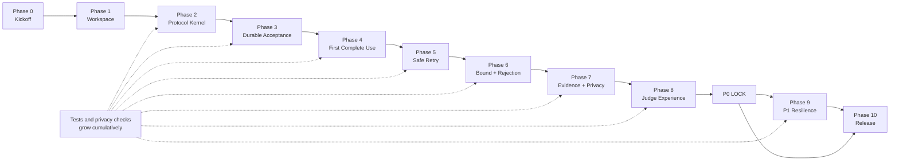

# AnonLimit Implementation Phases

## Dependency-Ordered Hackathon Build Plan

| Field | Value |
|---|---|
| Status | Phases 0–5 complete; G5 passed; Phase 6 is next |
| Target | Judge-ready P0 in 24 hours; P0 plus high-value P1 in 48 hours |
| Source of requirements | prd.md |
| Source of architecture | architecture.md |
| Engineering contract | rules.md |
| Delivery strategy | Working vertical slices with cumulative stop/go gates |

---

## 1. Finish line

The required final result is:

> Three allowed uses. Three committed actions. Zero extra consumption on retry. The fourth use rejected. Zero stored identity. No link between distinct legitimate uses.

Every phase must move the real system toward that result. Do not build disconnected mock screens, placeholder counters, or fake receipts that will later need to be replaced.

---

## 2. How to use this plan

- Complete phases in order unless a task is explicitly marked safe to parallelize.
- Treat every exit gate as blocking.
- Gates are cumulative: a phase passes only when its new checks and all earlier checks pass.
- Mark implementation tasks complete only after code and tests both exist. Phase 0 uses the recorded scope decisions, ownership, source review, and prerequisite command evidence in [the kickoff record](docs/phase-0-kickoff.md).
- Keep one reusable golden scenario across integration tests, Playwright, and the live demo.
- If a phase fails, repair it before adding behavior on top.
- P1 begins only after the complete P0 scenario works repeatedly from reset.
- P2 is outside the hackathon critical path.

### Status legend

| Symbol | Meaning |
|---|---|
| [ ] | Not started |
| [x] | Complete and gate passed |
| BLOCKED | Exit gate is failing; do not begin the next phase |

---

## 3. Build strategy

### Vertical-slice rule

After the short foundation work, each phase must leave the application runnable:

1. Repository starts.
2. Protocol contracts prove the bounded-use model.
3. A valid presentation becomes durable accepted work.
4. The browser receives one real external receipt.
5. A lost acknowledgement recovers that receipt.
6. Three uses succeed and the fourth changes nothing.
7. The backend proves every invariant.
8. The UI tells that story clearly.
9. Optional races and crashes preserve the same result.
10. A clean checkout reproduces it.

### What must never be faked

- Use acceptance.
- Usage counts.
- External-action counts.
- Receipts.
- Retry reconciliation.
- Over-limit rejection.
- Linkability result.
- Privacy audit.
- Final invariant cards.

Temporary UI skeletons may exist, but they must clearly show unavailable state until connected to real behavior.

---

## 4. Phase dependency map



Phase 9 is optional for a 24-hour event. Phase 10 is never optional.

---

## 5. Master phase table

| Status | Phase | Timebox | Concrete milestone | Blocking gate |
|---|---|---:|---|---|
| [x] | 0. Kickoff and scope lock | 0.5–1 h | Scope, ownership, and local prerequisites verified | Kickoff evidence and local prerequisites pass |
| [x] | 1. Repository foundation | 1–2 h | Four apps and shared packages build; PostgreSQL is healthy | Clean install, typecheck, build, migration shell |
| [x] | 2. Protocol kernel | 2–3 h | Contracts and opaque adapter prove protocol semantics | Unit and opaque-adapter contract suites pass |
| [x] | 3. Durable acceptance | 3–4 h | One valid proof atomically creates one use and outbox item | Real PostgreSQL commit/rollback tests pass |
| [x] | 4. First complete use | 4–5 h | Browser wallet reaches one stable Action Simulator receipt | One-use end-to-end test passes |
| [x] | 5. Safe retry | 2–3 h | Lost acknowledgement returns the original receipt | Zero retry use/action delta |
| [ ] | 6. Bound and rejection | 2–3 h | Three uses succeed; fourth and conflicts mutate nothing | Headless P0 golden scenario passes |
| [ ] | 7. Evidence and privacy | 3–4 h | Backend-derived invariant and linkability report passes | Full privacy suite passes |
| [ ] | 8. Judge experience | 3–5 h | Guided browser demo finishes under three minutes | Playwright P0 golden flow passes |
| [ ] | 9. P1 resilience | 3–5 h | 20-request race and worker crash recover correctly | Full race/recovery variant passes |
| [ ] | 10. Release and rehearsal | 2–4 h | Clean checkout, cold start, soak, and demo are stable | Release checklist passes |

The estimates are timeboxes, not permission to skip a failing gate.

---

## 6. Phase 0 — Kickoff and scope lock

### Objective

Remove ambiguity before code is created.

### Preconditions

- prd.md, architecture.md, and rules.md exist.

### Tasks

- [x] Read the three source documents.
- [x] Confirm the default policy is exactly three uses.
- [x] Confirm the final demo sequence:
  1. Reset.
  2. Issue.
  3. Use one.
  4. Submit use two with a dropped acknowledgement.
  5. Retry use two and recover the original result.
  6. Submit use three.
  7. Reject use four.
  8. Run linkability and privacy evidence.
- [x] Confirm Node.js 24 LTS, pnpm, Docker, and PostgreSQL can run on every development machine.
- [x] Assign one integration captain.
- [x] Assign file ownership if multiple people are working.
- [x] Agree that opaque crypto is an interface contract, not a production cryptography implementation.
- [x] Agree that P2 will not begin during the hackathon.
- [x] Create a short task board using the phase IDs in this document.

Recorded decisions, ownership, and command evidence: [Phase 0 kickoff](docs/phase-0-kickoff.md). Node 24, pnpm, Docker engine startup through Windows Explorer, and an actual PostgreSQL 17 SQL check passed at kickoff. The current team has one implementation owner; additional machines must repeat the checks when added. Later application and product gates were verified in the subsequent phase records.

### Decisions that are already closed

- TypeScript monorepo.
- Four runtime apps: web, API, worker, and Action Simulator.
- PostgreSQL outbox; no Redis or broker.
- Browser IndexedDB wallet.
- Separate verifier and action database schemas.
- Backend-derived evidence.
- No identity-based counter.

### Output

A shared understanding of what will be built and what will not be built.

### Exit gate

- Every contributor can explain the one-sentence pitch.
- Every contributor knows the critical path and their owned files.
- No open decision blocks Phase 1.
- No one is planning a second architecture or alternate stack.
- Node 24, pnpm, Docker engine/Compose, and a PostgreSQL 17 query are verified on each participating development machine.

### Stop condition

If the team disagrees about the use-consumption point, retry semantics, crypto boundary, or source of evidence, resolve that disagreement in the documents before scaffolding.

---

## 7. Phase 1 — Repository and runtime foundation

### Objective

Create a small, enforceable workspace in which all processes compile and PostgreSQL starts. Do not implement fake product behavior.

### Tasks

- [x] Initialize the pnpm workspace and commit pnpm-lock.yaml.
- [x] Pin Node.js major version 24.
- [x] Configure strict TypeScript.
- [x] Configure ESLint dependency-boundary rules.
- [x] Configure Prettier, Vitest, and Playwright.
- [x] Scaffold:
  - apps/web
  - apps/api
  - apps/worker
  - apps/action-simulator
- [x] Scaffold:
  - packages/domain
  - packages/contracts
  - packages/crypto
  - packages/db
  - packages/config
  - packages/observability
  - packages/testing
- [x] Add explicit package export maps.
- [x] Implement typed server and browser configuration parsing.
- [x] Add safe health endpoints only.
- [x] Add Docker Compose with PostgreSQL 17.
- [x] Add the migration-job shell and service health checks.
- [x] Add .env.example with safe placeholders.
- [x] Ensure real environment files and keys are ignored.
- [x] Add root scripts required by rules.md.

### Key files

```text
package.json
pnpm-workspace.yaml
pnpm-lock.yaml
tsconfig.base.json
eslint.config.mjs
prettier.config.mjs
vitest.workspace.ts
playwright.config.ts
compose.yaml
.env.example

apps/*/package.json
apps/api/src/app.ts
apps/api/src/server.ts
apps/action-simulator/src/app.ts
apps/worker/src/main.ts
apps/web/src/main.tsx

packages/config/src/server-env.ts
packages/config/src/client-env.ts
```

### Safe parallel work

- Integration captain: root configuration and package versions.
- Data owner: PostgreSQL container and migration job.
- Web owner: Vite/React shell only.
- QA owner: root script and CI skeleton.

Do not let several contributors edit root configuration simultaneously.

### Required verification

```text
pnpm format:check
pnpm lint
pnpm typecheck
pnpm build
docker compose config
```

### Output

- All four apps compile.
- PostgreSQL becomes healthy.
- Configuration fails closed when a required value is missing.
- No product route pretends that a use succeeded.

### Exit gate — G1 Foundation

- Clean installation succeeds with the frozen lockfile.
- Every app starts or exposes a real health response.
- PostgreSQL uses the pinned major version.
- Production packages cannot import packages/testing.
- Browser code cannot import database or server-only crypto packages.
- No environment file, key, credential fixture, or secret is committed.

G1 passed on 2026-09-05. Actual checks, compatibility fixes, and limitations are recorded in [the foundation record](docs/phase-1-foundation.md) and [memory.md](memory.md).

### Stop condition

Do not begin protocol implementation while type checking, dependency boundaries, Docker startup, or configuration parsing is broken.

---

## 8. Phase 2 — Protocol kernel and opaque crypto contract

### Objective

Lock the protocol vocabulary and prove the opaque interface behavior before transport and persistence depend on it.

### Tasks

- [x] Define Zod contracts for:
  - Policy.
  - Issuance.
  - Challenge.
  - Presentation.
  - Operation/action.
  - Use result.
  - Protocol event.
  - Evidence report.
  - Demo controls.
- [x] Reject unknown public fields.
- [x] Define typed domain errors and result variants.
- [x] Implement canonical quota-scope construction.
- [x] Implement canonical action serialization and intent digest.
- [x] Implement stable action-key derivation.
- [x] Implement use-state transition guards.
- [x] Implement exact-retry versus conflict classification.
- [x] Implement invariant-report calculations as pure functions.
- [x] Define separate holder, issuer, verifier, and audit crypto entrypoints.
- [x] Implement the deterministic simulated provider behind those interfaces.
- [x] Protect package exports so server-only crypto cannot enter the browser.
- [x] Document provider assumptions in packages/crypto/README.md.
- [x] Implement safe event and error serializers.
- [x] Inject clocks, randomness, and adapters for deterministic tests.

### Key files

```text
packages/contracts/src/*.contract.ts
packages/contracts/src/public-field-allowlist.ts

packages/domain/src/policy.ts
packages/domain/src/quota-scope.ts
packages/domain/src/intent.ts
packages/domain/src/use-state.ts
packages/domain/src/retry-classifier.ts
packages/domain/src/invariants.ts
packages/domain/src/errors.ts

packages/crypto/src/holder/index.ts
packages/crypto/src/issuer/index.ts
packages/crypto/src/verifier/index.ts
packages/crypto/src/audit/linkability.ts
packages/crypto/src/simulated-provider/*
packages/crypto/README.md

packages/observability/src/*
tests/contract/opaque-crypto-provider.test.ts
```

### Required tests

- Canonical scope is stable and server-controlled.
- Canonical intent is stable across reordered JSON keys.
- Changed action content changes the intent digest.
- State transitions are exhaustive.
- Retry classification covers new, pending, succeeded, failed-final, and conflict states.
- Public schemas reject unknown and identity-bearing fields.
- Event serializers output only allowed fields.
- Opaque adapter contract proves:
  - Slots zero through L minus one verify.
  - Slot L and other invalid slots fail.
  - Same credential, scope, and slot yields the same nullifier.
  - Different valid slots yield distinct nullifiers.
  - Same-use retry returns SAME_USE.
  - Different valid slots return UNLINKABLE.
  - Changed audience, policy, window, challenge, operation, or intent fails where applicable.
  - Copying a credential does not increase its nullifier set.
  - Public output exposes no hidden slot or credential-wide identifier.

### Required commands

```text
pnpm format:check
pnpm lint
pnpm typecheck
pnpm test:unit
pnpm test:contract
pnpm test:privacy
pnpm build
```

### Output

A framework-independent protocol kernel and a replaceable simulated crypto provider.

### Exit gate — G2 Contract freeze

- All adapter guarantees are represented by passing contract tests.
- Domain behavior is pure and does not import framework code.
- Wire contracts are runtime-validated.
- Holder-only crypto is the only crypto entrypoint available to the browser.
- Protocol and error names are frozen for the next vertical slice.

G2 passed on 2026-09-05. The strict contracts, pure domain behavior, opaque adapter guarantees,
browser export checks, test counts, provider limitations, and cumulative runtime verification are
recorded in [the Phase 2 protocol record](docs/phase-2-protocol.md) and [memory.md](memory.md).

### Stop condition

Do not create verifier persistence around an adapter that cannot prove deterministic same-slot nullifiers, out-of-range rejection, and distinct-use unlinkability.

---

## 9. Phase 3 — Database foundation and durable acceptance

### Objective

Take one real HTTP presentation through validation and proof verification into one atomic accepted-use record with durable recovery work.

### Tasks

- [x] Create PostgreSQL schemas and separate database roles.
- [x] Add verifier tables:
  - demo_runs
  - quota_policies
  - verification_challenges
  - use_records
  - outbox_events
  - protocol_events
  - demo_faults
- [x] Add Action Simulator tables:
  - action_results
  - action_faults
- [x] Add state check constraints and supporting indexes.
- [x] Add required uniqueness constraints.
- [x] Implement append-only SQL migrations.
- [x] Implement an idempotent default-policy seed.
- [x] Implement repository interfaces and Drizzle schemas.
- [x] Implement policy and issuance endpoints.
- [x] Implement challenge creation.
- [x] Implement presentation parsing and public-field allowlisting.
- [x] Compute the protected nullifier lookup in request memory.
- [x] Resolve existing use or operation conflicts before freshness rejection.
- [x] Validate challenge, policy, audience, window, and expiry.
- [x] Call the opaque verifier before any usage-state write.
- [x] Implement the acceptance transaction.
- [x] Catch uniqueness failures by constraint name.
- [x] Add a first privacy schema scan.

### Acceptance transaction

One transaction must:

1. Lock and recheck the authoritative policy and challenge.
2. Insert one ACCEPTED_PENDING_ACTION use record.
3. Mark the challenge CONSUMED.
4. Insert one READY outbox event.
5. Insert one privacy-safe USE_ACCEPTED event.
6. Commit all changes together.

No HTTP request, provider call, arbitrary sleep, or other unbounded I/O may occur while the transaction is open.

### Required constraints

```sql
UNIQUE (demo_run_id, scope_hash, nullifier_key)
UNIQUE (demo_run_id, scope_hash, operation_id)
UNIQUE (action_key)
UNIQUE (use_id, event_type)
```

### Key files

```text
infra/postgres/00-create-schemas-and-roles.sql
packages/db/migrations/verifier/*.sql
packages/db/migrations/action/*.sql
packages/db/src/verifier/*
packages/db/src/action/*
packages/db/src/transaction.ts

apps/api/src/modules/policies/*
apps/api/src/modules/issuer/*
apps/api/src/modules/challenges/*
apps/api/src/modules/presentations/*

scripts/migrate.ts
scripts/seed-default-policy.ts
tests/integration/presentation-flow.test.ts
tests/privacy/schema-audit.test.ts
```

### Required tests

- Migrations apply to an empty PostgreSQL 17 instance.
- Seed may run twice without changing the immutable policy.
- Valid proof creates one use, one outbox event, and one safe event.
- Challenge becomes consumed in the same commit.
- Invalid proof creates no durable state.
- Expired first-use challenge creates no durable state.
- Policy mismatch creates no durable state.
- Forced transaction failure rolls back every mutation.
- Immutable accepted-use fields cannot be updated.
- Verifier schema has no identity, credential ID, hidden slot, raw credential, raw proof, or raw nullifier field.

Transaction tests MUST use real PostgreSQL through Testcontainers.

### Output

A real backend slice ending in ACCEPTED_PENDING_ACTION.

### Exit gate — G3 Durable acceptance

- One valid presentation creates exactly one use and recovery item.
- A rejected or rolled-back presentation creates neither.
- Migration drift and schema privacy checks pass.
- The database, not process memory, is authoritative for uniqueness.

### Stop condition

Do not build external processing if an accepted use can exist without an outbox event, or if an invalid proof can mutate usage state.

G3 passed on 2026-09-05. The empty-database bootstrap, migration order/drift checks, schema metadata parity,
durable acceptance transaction, race and freshness behavior, public error handling, least-privilege worker
runtime, and privacy checks are recorded in [the Phase 3 record](docs/phase-3-durable-acceptance.md) and [memory.md](memory.md).

---

## 10. Phase 4 — First complete end-to-end use

### Objective

Complete one real use from a browser-held credential to one stable external receipt.

### Tasks

#### Action Simulator

- [x] Implement POST /internal/v1/actions.
- [x] Enforce unique action_key.
- [x] Return the existing receipt for the same key and payload digest.
- [x] Reject the same key with a changed digest as an integrity conflict.
- [x] Add sanitized internal evidence.
- [x] Restrict routes with a service token.

#### Worker

- [x] Claim outbox work in bounded batches with FOR UPDATE SKIP LOCKED.
- [x] Persist the lease and commit before HTTP delivery.
- [x] Send only action key, digest, demo run ID, and allowlisted action.
- [x] Cache the receipt and mark use/outbox completion atomically.
- [x] Append a safe completion event.
- [x] Add graceful shutdown.

#### Holder Wallet and minimal UI

- [x] Implement IndexedDB schema.
- [x] Persist credential and local slot state.
- [x] Persist a pending operation before its first network send.
- [x] Implement real issuance.
- [x] Request a real verifier challenge.
- [x] Create a presentation with the holder adapter.
- [x] Submit to the real verifier.
- [x] Poll or wait for the real result.
- [x] Display only issue, submit, pending state, and receipt.
- [x] Connect all processes through Docker Compose.

### Key files

```text
apps/action-simulator/src/*
apps/worker/src/*
apps/api/src/internal/action-simulator-client.ts
apps/api/src/modules/presentations/wait-for-outcome.ts

apps/web/src/features/wallet/wallet-db.ts
apps/web/src/features/wallet/wallet-service.ts
apps/web/src/lib/api-client.ts
apps/web/src/features/demo-lab/DemoLabPage.tsx

tests/integration/action-idempotency.test.ts
tests/integration/presentation-flow.test.ts
tests/e2e/golden-demo.spec.ts
```

### Required tests

- [x] Wallet persists credential, slot, operation, intent, nullifier, and envelope before send.
- [x] One delivery creates one Action Simulator result.
- [x] Repeated delivery with same key and digest returns the same receipt.
- [x] Same key with changed digest is an integrity error.
- [x] Use and outbox completion update together.
- [x] Browser refresh preserves wallet and pending-operation state.
- [x] Minimal Playwright smoke test performs issuance, one use, and one receipt.
- [x] First vertical slice passes the database, log, and browser-bundle privacy checks.

### Output

A genuine vertical slice:

```text
Browser Wallet
  -> Verifier API
  -> PostgreSQL acceptance + outbox
  -> Worker
  -> Action Simulator
  -> Stable receipt
  -> Browser Wallet
```

### Exit gate — G4 One-use milestone

Authoritative state must show:

```text
accepted uses        = 1
outbox events        = 1
external actions     = 1
distinct receipts    = 1
```

No mock server, hard-coded receipt, frontend count, or direct API write into action tables may be involved.

### Completion record

G4 passed on 2026-09-05 through Docker Compose after a clean bounded demo reset. PostgreSQL reported one accepted use and one outbox event; the Action Simulator reported one external action and one distinct receipt. The Playwright golden scenario issued a browser-held credential, completed one use, and recovered the same receipt after refresh. Focused integration coverage passed the action idempotency/conflict and worker lease/completion paths.

### Stop condition

If one browser action cannot travel through every real component, stop all UI polish and repair this path.

---

## 11. Phase 5 — Lost acknowledgement and exact retry

### Objective

Make an uncertain network outcome safe without spending a new slot or duplicating the external action.

### Tasks

- [x] Add deterministic one-shot drop-next-ack control.
- [x] Drop the response only after use, action, and receipt are durable.
- [x] Change the wallet operation to OUTCOME_UNKNOWN.
- [x] Retain the same slot and serialized operation.
- [x] Retry the stored operation.
- [x] Resolve accepted use before rejecting an expired challenge.
- [x] Return RETRY_IN_PROGRESS for pending work.
- [x] Return RETRY_RESOLVED and the cached receipt for completed work.
- [x] Return usageDelta zero and actionDelta zero.
- [x] Add distinct event and UI states for:
  - New acceptance.
  - Acknowledgement dropped.
  - Unknown outcome.
  - Retry matched.
  - Receipt recovered.
- [x] Test retry after the original challenge expires.
- [x] Test API failure after acceptance commit.

### Key files

```text
apps/api/src/modules/presentations/resolve-existing-use.ts
apps/api/src/modules/presentations/wait-for-outcome.ts
apps/api/src/modules/demo/fault-controller.ts
apps/api/src/modules/demo/demo.routes.ts
apps/api/src/modules/protocol/protocol-service.ts

apps/web/src/features/wallet/wallet-db.ts
apps/web/src/features/wallet/wallet-service.ts

packages/domain/src/retry-classifier.ts
packages/db/src/verifier/repository.ts
```

### Required tests

- [x] Timeout does not advance the wallet slot.
- [x] Pending exact retry creates no new use or outbox row.
- [x] Completed exact retry returns the original receipt.
- [x] Exact retry after challenge expiry still recovers the committed result.
- [x] API failure after acceptance commit is recoverable.
- [x] Same nullifier with changed intent is a conflict.
- [x] Same operation ID with changed content is a conflict.
- [x] The original use remains immutable after either conflict.

### Output

A visible lost-acknowledgement demonstration with safe recovery.

### Exit gate — G5 Retry safety

```text
retry usage delta       = 0
retry action delta      = 0
recovered receipt       = original receipt
wallet slot advanced    = false
new outbox event        = false
```

### Completion record

G5 passed on 2026-09-05. A real HTTP socket test armed one operation, completed its use through the independent Action Simulator and worker, and withheld a valid acknowledgement only after `SUCCEEDED`, cached receipt, and delivered outbox state were durable. Reposting the exact serialized envelope after challenge expiry returned the original receipt with zero deltas and no new use, outbox row, action, or receipt. The browser scenario preserved `OUTCOME_UNKNOWN` and the same local slot across refresh, then recovered through an explicit byte-identical retry. See [the Phase 5 record](docs/phase-5-safe-retry.md).

### Stop condition

Do not implement the multi-use scenario while a timeout can allocate a new slot or a retry can enqueue replacement work.

---

## 12. Phase 6 — Exact bound, rejection, and reset

### Objective

Complete the required headless P0 protocol: three distinct uses succeed, the lost acknowledgement is recovered, and the fourth attempt changes nothing.

### Tasks

- [ ] Support all three valid hidden slots.
- [ ] Add a controlled out-of-range fourth-slot attempt.
- [ ] Return public PRESENTATION_REJECTED.
- [ ] Allow BOUND_EXCEEDED only as a private demo diagnostic.
- [ ] Reject invalid policy, audience, quota window, challenge, and proof.
- [ ] Reject conflicting reuse without altering the original use.
- [ ] Implement reset scoped to one demo run.
- [ ] Reset verifier and Action Simulator state through owned APIs.
- [ ] Never drop schemas or truncate unrelated data.
- [ ] Create one reusable headless golden scenario.
- [ ] Add backend assertions after every scenario step.

### Key files

```text
apps/api/src/modules/presentations/submit-presentation.ts
apps/api/src/modules/presentations/resolve-existing-use.ts
apps/api/src/modules/demo/reset-demo.ts
apps/action-simulator/src/routes/demo.routes.ts

packages/testing/src/scenarios/golden-scenario.ts
scripts/reset-demo.ts
scripts/run-golden.ts
```

### Core P0 golden flow

1. Reset and assert zero use/action state.
2. Load the three-use policy.
3. Issue one credential.
4. Submit slot zero successfully.
5. Arm drop-next-ack.
6. Submit slot one; durable work completes but the wallet sees unknown outcome.
7. Retry slot one and recover the original receipt with zero deltas.
8. Submit slot two normally.
9. Attempt slot three and reject it without mutation.

### Required tests

- Three valid slots produce three uses and three actions.
- Fourth-slot attempt creates no use, outbox, action, receipt, or consumed challenge.
- Invalid presentations create no durable use state.
- Conflicting replay leaves the original operation and receipt unchanged.
- Reset affects only the selected demo run.
- The scenario is deterministic with injected clock and seeded randomness.

### Output

The complete required protocol works without relying on the final UI.

### Exit gate — G6 Backend P0

```text
declared_limit                       = 3
accepted_distinct_uses               = 3
committed_external_actions           = 3
extra_uses_from_retry                = 0
extra_actions_from_retry             = 0
over_limit_mutations                 = 0
all_receipts_stable                  = true
```

Run the core headless scenario repeatedly. Any intermittent result blocks the next phase.

### Stop condition

Do not begin optional race or crash work. The required bound, retry, and reset behavior must be deterministic first.

---

## 13. Phase 7 — Authoritative evidence and privacy

### Objective

Turn protocol behavior into machine-derived proof that judges and auditors can inspect.

### Tasks

- [ ] Add sanitized verifier evidence views and queries.
- [ ] Add the Action Simulator evidence endpoint.
- [ ] Build the invariant report from verifier and action state.
- [ ] Persist allowlisted protocol events.
- [ ] Add the safe SSE event stream.
- [ ] Support reconnect from the last event sequence.
- [ ] Accept linkability-test presentations transiently from the wallet.
- [ ] Run every pair of distinct accepted presentations.
- [ ] Verify the exact retry returns SAME_USE.
- [ ] Do not persist raw presentations or grouping labels.
- [ ] Return INCOMPLETE if the linkability adapter is unavailable.
- [ ] Add schema, value, log, outbox, event, export, import-graph, and browser-bundle scanners.
- [ ] Ensure every final UI metric can be supplied by the Evidence API.

### Key files

```text
packages/db/src/verifier/evidence.queries.ts
packages/db/migrations/verifier/*evidence*.sql
packages/domain/src/invariants.ts
packages/observability/src/*

apps/api/src/modules/evidence/*
apps/api/src/modules/events/*

packages/testing/src/assertions/*
packages/testing/src/scanners/*
tests/privacy/*
scripts/scan-forbidden-data.ts
```

### Required tests

- Invariant calculator returns PASS for a valid snapshot.
- It returns FAIL for deliberately inconsistent use/action counts.
- It never treats unavailable audit data as PASS.
- Distinct use pairs return UNLINKABLE.
- Exact retry pair returns SAME_USE.
- Evidence counts match independent verifier and Action Simulator queries.
- SSE reconnect returns missed safe events only.
- Demo reset affects only the selected run.
- Demo/audit routes are absent when DEMO_MODE is false.
- Forbidden-data scan covers:
  - information_schema
  - Persisted rows
  - Logs
  - Events
  - Outbox payloads
  - API responses
  - Evidence exports
  - Web build assets
  - Production dependency graph

### Required evidence result

```text
declared_limit                         = 3
accepted_distinct_uses                 = 3
committed_external_actions             = 3
extra_uses_from_retry                  = 0
extra_actions_from_retry_or_race       = 0
over_limit_mutations                   = 0
stored_holder_identities               = 0
stored_credential_wide_identifiers     = 0
linked_distinct_legitimate_use_pairs   = 0
all_receipts_stable                    = true
all_invariants                         = PASS
```

### Output

One API response and one audit run prove every required claim from authoritative sources.

### Exit gate — G7 Evidence P0

- All required invariant fields are present and PASS.
- No value is copied from a frontend-maintained counter.
- Linkability inputs disappear after the request.
- Schema, persisted values, logs, events, outbox, exports, and browser assets pass the privacy suite.
- The evidence result remains correct after browser refresh and service restart.

### Stop condition

Do not build attractive invariant cards around a report that can falsely pass, omit unavailable data, or read wallet/test-harness counters.

---

## 14. Phase 8 — Guided judge experience and P0 lock

### Objective

Present the real system as a clear, memorable demonstration that completes in under three minutes.

### Tasks

- [ ] Build the final Demo Lab layout.
- [ ] Add guided controls:
  - Issue credential.
  - Present next use.
  - Drop next acknowledgement.
  - Retry last request.
  - Attempt fourth use.
  - Run privacy audit.
  - Reset.
- [ ] Build the local-only Holder Wallet panel.
- [ ] Build the Issuer → Wallet → Verifier → Action Service swimlane.
- [ ] Build the sanitized verifier evidence table.
- [ ] Build the invariant summary.
- [ ] Build the linkability matrix.
- [ ] Build the opaque-crypto assumptions card.
- [ ] Drive the UI only from real API commands, safe events, and evidence.
- [ ] Make new acceptance, unknown outcome, recovered retry, and rejection visually distinct.
- [ ] Do not animate retry as another use.
- [ ] Add text and icons in addition to color.
- [ ] Add loading, timeout, recoverable-error, and reset states.
- [ ] Implement the P0 Playwright golden scenario.
- [ ] Write and rehearse the 2–3-minute narration.

### Key files

```text
apps/web/src/features/demo-lab/*
apps/web/src/features/wallet/*
apps/web/src/features/protocol-trace/*
apps/web/src/features/evidence/*
apps/web/src/features/invariants/*
apps/web/src/features/linkability/*
apps/web/src/features/assumptions/*
apps/web/src/components/ui/*

tests/e2e/golden-demo.spec.ts
docs/demo-script.md
```

### Judge flow

1. State the paradox.
2. Reset and show zero authoritative uses/actions.
3. Issue the credential.
4. Complete use one.
5. Drop the acknowledgement for use two.
6. Show the wallet's unknown outcome while durable work is complete.
7. Retry the same operation and recover the same receipt with zero deltas.
8. Complete use three normally.
9. Reject use four with no mutation.
10. Run linkability and privacy checks.
11. Finish on the all-PASS invariant panel.

### Required tests

- Playwright runs the complete flow without mocked backend behavior.
- Browser refresh preserves wallet and pending operation.
- UI counts match independently queried backend evidence.
- Retry and new-use visuals cannot be confused.
- Wallet slots are labeled local-only.
- Opaque-crypto assumptions are visible.
- Keyboard navigation and text status work without depending only on color.
- Timed run finishes in less than 180 seconds.

### Output

A polished, repeatable P0 submission.

### Exit gate — G8 P0 lock

- Complete browser scenario passes repeatedly from reset.
- Every invariant is PASS.
- Privacy suite is clean.
- Docker Compose cold start succeeds.
- Demo finishes under three minutes.
- No UI screen relies on fake counters, receipts, events, or audit output.

After this gate, P0 is protected. Any later change that breaks it is reverted or fixed before other work continues.

### Stop condition

P1 MUST NOT begin before G8 passes.

---

## 15. Phase 9 — Optional P1 concurrency and crash recovery

### Objective

Raise the stable P0 demo into a stronger distributed-systems proof without risking the submission.

This phase may be omitted only for a minimum P0 submission under a hard 24-hour deadline. It is required for the full project definition of done in rules.md and is strongly recommended for a winning submission.

### Preconditions

- G8 P0 lock has passed repeatedly.
- The team has enough time remaining for a release buffer.

### Tasks

#### Concurrent presentation race

- [ ] Add a synchronization barrier.
- [ ] Submit 20 identical copies of one fresh valid presentation.
- [ ] Catch uniqueness conflicts by constraint name.
- [ ] Roll back losing transactions.
- [ ] Load the winning use.
- [ ] Make all successful callers converge on one use and receipt.
- [ ] Replace the normal third-use step in the full golden scenario with this race.

#### Worker recovery

- [ ] Test two workers competing for outbox work.
- [ ] Prove they cannot own the same live lease.
- [ ] Recover an expired lease.
- [ ] Inject worker exit before action delivery.
- [ ] Inject worker exit after external commit but before verifier completion.
- [ ] Redeliver with the same action key.
- [ ] Return the Action Simulator's original receipt.
- [ ] Add bounded exponential backoff.
- [ ] Add visible DEAD_LETTER state after exhaustion.
- [ ] Add UI controls only after backend fault tests are deterministic.

### Key files

```text
apps/api/src/modules/presentations/submit-presentation.ts
apps/api/src/modules/demo/fault-controller.ts

apps/worker/src/lease-outbox-batch.ts
apps/worker/src/process-action.ts
apps/worker/src/complete-use.ts
apps/worker/src/retry-policy.ts

apps/action-simulator/src/commit-action.ts

packages/testing/src/harness/create-test-system.ts
tests/integration/concurrent-duplicate.test.ts
tests/integration/outbox-recovery.test.ts
tests/integration/action-idempotency.test.ts
scripts/run-concurrency-race.ts
```

### Required tests

- Twenty requests genuinely overlap; a sequential loop is not accepted.
- Race creates exactly:

```text
use records        = 1
outbox events      = 1
action keys        = 1
external actions   = 1
distinct receipts  = 1
```

- Competing workers never own one active lease.
- Expired lease is recovered.
- Crash before delivery leaves durable work.
- Crash after external commit recovers the original receipt.
- Same action key with changed payload is an integrity failure.
- Transient action failure uses bounded retry.
- Exhausted work is visible, not discarded.
- All privacy scans pass across every fault path.

### Output

A live race and failure-recovery proof that preserves the P0 invariants.

### Exit gate — G9 Full resilience

- Full race variant passes deterministically.
- Worker fault matrix passes.
- P0 browser golden scenario remains green.
- Every race caller converges on the same use and terminal receipt.
- No fault releases an accepted slot or duplicates an effect.

### Rollback rule

If P1 introduces intermittent failure near feature freeze, remove the unstable UI control or revert the P1 feature. Never sacrifice the stable P0 path.

---

## 16. Phase 10 — Release, packaging, and rehearsal

### Objective

Make the project reproducible from a clean checkout and safe to present under hackathon conditions.

For a declared minimum 24-hour P0 release that omits Phase 9, run the core P0 golden scenario and all applicable correctness, recovery, privacy, and release checks. Explicitly report the omitted Phase 9 race/crash validation; it is required before claiming full-project completion. Every reference below to the full scenario or fault matrix uses the declared release scope, and no required P0 invariant may be waived.

### Tasks

- [ ] Finalize pinned Dockerfiles.
- [ ] Finalize Docker Compose startup order.
- [ ] Run migrations and seed as short-lived jobs.
- [ ] Add health and readiness checks.
- [ ] Verify worker has no public port.
- [ ] Verify internal Action Simulator routes require a service token.
- [ ] Verify demo routes are absent when DEMO_MODE is false.
- [ ] Expose all stable root commands.
- [ ] Add CI gates.
- [ ] Complete README setup and run instructions.
- [ ] Complete demo script and architecture explanation.
- [ ] Complete threat-model and limitations summary.
- [ ] Test a fresh checkout and empty database.
- [ ] Run the full fault matrix.
- [ ] Run at least ten consecutive full scenarios in release CI.
- [ ] Run the 100-iteration final soak.
- [ ] Perform three timed rehearsals:
  - Normal path.
  - Slow-worker or page-refresh recovery.
  - Clean Docker Compose startup.
- [ ] Record a backup demo after the live system is stable.
- [ ] Leave a final submission buffer.

### Required full quality gate

```text
pnpm format:check
pnpm lint
pnpm typecheck
pnpm test:unit
pnpm test:contract
pnpm test:integration
pnpm test:privacy
pnpm build
pnpm test:e2e
```

### Key files

```text
infra/docker/*.Dockerfile
infra/postgres/00-create-schemas-and-roles.sql
compose.yaml
.github/workflows/ci.yml
scripts/wait-for-services.ts
scripts/run-golden.ts
README.md
docs/demo-script.md
docs/threat-model.md
```

### Exit gate — G10 Submission

- Fresh checkout installs with a frozen lockfile.
- Empty-database migrations and seed pass.
- Docker Compose cold start passes.
- Reset produces a deterministic empty run.
- Full quality gate passes.
- Full fault matrix passes.
- Browser bundle and runtime privacy scans pass.
- Demo routes fail closed in non-demo mode.
- Ten consecutive release scenarios pass.
- Final soak reports 100 out of 100.
- No focused, skipped, quarantined, or placeholder P0 test remains.
- No unresolved P0 TODO, known invariant defect, or manual database workaround remains.
- Live demo repeatedly completes under three minutes.

One intermittent soak failure blocks release. Rerunning until it happens to pass does not waive the defect.

---

## 17. Cumulative verification matrix

| Gate | New proof added | Must continue passing |
|---|---|---|
| G1 | Workspace builds and starts | Configuration and dependency boundaries |
| G2 | Protocol and opaque-adapter contracts | G1 |
| G3 | Atomic acceptance and rollback | G1–G2 |
| G4 | Real one-use receipt | G1–G3 |
| G5 | Lost-ack retry with zero deltas | G1–G4 |
| G6 | Exact bound and zero-mutation rejection | G1–G5 |
| G7 | Authoritative evidence and privacy | G1–G6 |
| G8 | Complete browser P0 demo | G1–G7 |
| G9 | Race and crash recovery | G1–G8 |
| G10 | Clean start, soak, and rehearsal | Every applicable gate |

### Always-blocking failures

- A privacy scanner finding.
- A migration that fails from an empty database.
- A use without a durable outbox item.
- A duplicate external effect.
- A retry that advances a slot.
- An over-limit attempt that mutates state.
- A difference between UI counts and backend evidence.
- A test that passes only through timing sleeps or automatic retry.
- Any invariant that is not explicitly PASS.

---

## 18. Team work lanes

### Lane A — Protocol and API

Owns:

- Domain rules.
- Contracts.
- Opaque adapter interface.
- Issuer.
- Challenges.
- Presentation validation.
- Acceptance transaction.
- Retry classification.

Must not own:

- Action Simulator persistence.
- UI counters.

### Lane B — Reliability and data

Owns:

- PostgreSQL migrations and roles.
- Repositories.
- Outbox worker.
- Action Simulator.
- Docker Compose.
- Transaction, lease, and fault tests.

Must not own:

- Holder crypto.
- Verifier product rules.

### Lane C — Wallet and judge UI

Owns:

- IndexedDB wallet.
- Typed API client.
- Demo controls.
- Swimlane.
- Evidence and invariant presentation.
- Guided flow.

Must not own:

- Authoritative counters.
- Database access.
- Server-only crypto.

### Lane D — QA and privacy

Owns when a fourth contributor is available:

- Contract tests.
- Testcontainers.
- Privacy scanners.
- Playwright.
- CI.
- Soak runs.
- Release checklist.

Must not add late product features.

### Integration captain

One person owns:

- Root configuration.
- Dependency versions.
- Shared scripts.
- Contract-freeze decisions.
- Merge checkpoints.
- Full-gate status.

---

## 19. Safe parallelization

### May run in parallel

- Phase 1 web shell, Docker foundation, and root quality tooling.
- During Phase 2, QA may build contract tests while domain and adapter code are implemented.
- After G2, Action Simulator and worker skeletons may be built against the frozen internal action contract.
- After the Phase 3 schema stabilizes, privacy scanners may be developed alongside runtime flows.
- After G6, evidence backend and non-authoritative UI layout work may proceed in parallel.
- After G8, P1 backend robustness and presentation rehearsal may run in parallel.

### Must remain single-owner or serialized

- Root package configuration and lockfile conflict resolution.
- Canonical scope and intent behavior.
- Critical SQL migrations.
- Acceptance transaction.
- State-transition definitions.
- Shared public contracts.
- Final invariant calculation.

### Never parallelize

- Competing migrations against the same tables.
- P1 feature development while P0 is broken.
- Large refactors after P0 lock.
- UI assumptions that bypass frozen contracts.
- Multiple implementations of the same protocol rule.

---

## 20. Merge checkpoints

| Checkpoint | Earliest phase | Required evidence |
|---|---:|---|
| M0 — Contract freeze | 2 | Build, typecheck, dependency boundaries, and adapter contracts |
| M1 — Durable acceptance | 3 | Empty migration, atomic use/outbox commit, and rollback proof |
| M2 — One-use vertical slice | 4 | One use, outbox, action, and stable receipt |
| M3 — Backend P0 | 6 | Three uses, safe retry, and fourth-use rejection |
| M4 — P0 lock | 8 | Browser golden scenario, evidence, privacy, and cold start |
| M5 — Full resilience | 9 | Race, leases, redelivery, and stable receipt |
| Release | 10 | Full gate, clean checkout, soak, timed demo |

At every checkpoint:

1. Merge shared contracts first.
2. Rebase or update consumers.
3. Run affected tests immediately.
4. Run the cumulative gate.
5. Tag the checkpoint or record the commit hash.

---

## 21. 24-hour execution schedule

The 24-hour plan targets a polished P0. Phase 9 is skipped unless P0 locks early.

| Time | Focus | Required milestone |
|---|---|---|
| H0–H1 | Phase 0 | Scope, ownership, and demo locked |
| H1–H3 | Phases 1–2 foundation | Workspace, contracts, adapter behavior |
| H3–H7 | Phase 3 | Database and durable acceptance |
| H7–H11 | Phase 4 | One browser use reaches a real receipt |
| H11–H14 | Phases 5–6 | Lost-ack retry, three uses, fourth rejected |
| H14–H17 | Phase 7 | Evidence, linkability, and privacy |
| H17–H20 | Phase 8 | Guided UI and Playwright |
| H20 | Feature freeze | P0 must be locked |
| H20–H22 | Phase 10 hardening | Clean start, full tests, repeated runs |
| H22–H24 | Rehearsal and buffer | Timed demo, backup recording, packaging |

### 24-hour intervention triggers

- If G4 is not green by H11, cancel all P1 work.
- If G6 is not green by H14, replace SSE with bounded polling and simplify the UI.
- If G8 is not green by H20, stop visual polish until the browser flow passes.
- After H20, fix only correctness, privacy, startup, or presentation blockers.

---

## 22. 48-hour execution schedule

The 48-hour plan includes high-value P1 resilience and protected rest time.

| Time | Focus | Required milestone |
|---|---|---|
| H0–H2 | Phase 0 | Scope and ownership locked |
| H2–H5 | Phases 1–2 | Foundation and contract freeze |
| H5–H11 | Phases 3–4 | Durable acceptance and one-use receipt |
| H11–H16 | Phases 5–6 | Complete backend P0 |
| H16–H21 | Phases 7–8 | Evidence, privacy, guided browser P0 |
| H21 | P0 lock | G8 passes |
| H21–H27 | Stabilization and staggered rest | Repeated P0 tests and clean-start fixes |
| H27–H34 | Phase 9 | Race, worker crash, and redelivery |
| H34–H39 | Phase 10 | Full fault matrix, privacy, and soak |
| H39 | Feature freeze | No new behavior |
| H39–H44 | Rehearsal | Presenter and backup-presenter practice |
| H44–H48 | Submission buffer | Blockers, packaging, final clean run |

Do not begin P2 even if the event is 48 hours.

---

## 23. Scope-cut ladder

If the project is late, cut in this order:

1. All P2 features.
2. Sanitized evidence export.
3. Decorative animation.
4. SSE; retain persisted events and use bounded polling.
5. Worker-crash and race controls in the UI; retain stable tests if they already exist.
6. Pairwise matrix visualization; retain the required aggregate linkability result.
7. Conflicting-replay as a live demo step.
8. Hosted deployment; retain one-command local Docker Compose.

Never cut:

- Opaque-adapter contract tests.
- PostgreSQL uniqueness constraints.
- Atomic use-and-outbox acceptance.
- Independently idempotent Action Simulator.
- Durable wallet operation before send.
- Lost-acknowledgement recovery.
- Over-limit rejection with zero mutation.
- Linkability test.
- Backend-derived evidence.
- Privacy-safe storage and logging.
- Deterministic reset.
- One real automated golden scenario.
- Honest opaque-crypto labeling.

---

## 24. Per-phase working rhythm

Use this loop for every phase:

1. Restate the phase outcome in one sentence.
2. Freeze or update the needed contract.
3. Write the narrow failure-focused test.
4. Implement the smallest real vertical behavior.
5. Inspect persisted state directly.
6. Run the narrow test suite.
7. Run the cumulative gate.
8. Update documentation if behavior changed.
9. Commit or mark the checkpoint.
10. Begin the next phase only after the exit gate passes.

Avoid:

- Large untested batches.
- Long-lived branches.
- UI-only completion claims.
- Manual database changes.
- Arbitrary sleeps in tests.
- Automatic retries that hide flaky invariants.
- Late architecture rewrites.

---

## 25. Demo rehearsal plan

Target 2 minutes 15 seconds, leaving recovery time inside the three-minute limit.

### Rehearsal script

1. “Most services enforce a limit by tracking an account. AnonLimit enforces three uses without learning who owns them.”
2. Reset and show zero authoritative uses and actions.
3. Issue the opaque credential.
4. Complete use one.
5. Arm the dropped acknowledgement.
6. Submit use two and show the wallet's unknown outcome.
7. Retry the same stored operation.
8. Show the same receipt and zero additional deltas.
9. Complete use three.
10. Reject use four without changing state.
11. Run the linkability check.
12. End on the all-PASS invariant summary.

### Required rehearsals

- Normal expected path.
- Page refresh or slow-worker recovery.
- Fresh Docker Compose startup.
- Backup presenter.
- Backup recorded demo.

### Questions every presenter must answer

- Why can the verifier enforce a bound without a credential counter?
- Why is a retry intentionally linkable to the same use?
- Why are different valid uses not linkable?
- What does the opaque crypto interface guarantee?
- Where is a use considered consumed?
- How does PostgreSQL stop concurrent duplicates?
- Why can the outbox deliver more than once without duplicating the action?
- What data does the verifier deliberately not store?

---

## 26. Final phase tracker

| Phase | Gate | Status |
|---|---|---|
| 0. Kickoff | Scope, ownership, and local prerequisites verified | [x] |
| 1. Repository foundation | G1 | [x] |
| 2. Protocol kernel | G2 | [x] |
| 3. Durable acceptance | G3 | [x] |
| 4. First complete use | G4 | [x] |
| 5. Safe retry | G5 | [x] |
| 6. Bound and rejection | G6 | [ ] |
| 7. Evidence and privacy | G7 | [ ] |
| 8. Judge experience | G8 — P0 lock | [ ] |
| 9. P1 resilience | G9 — optional | [ ] |
| 10. Release | G10 — submission | [ ] |

The project is done only when G10 passes. A polished screen is not completion; a reproducible system that proves every invariant is completion.
